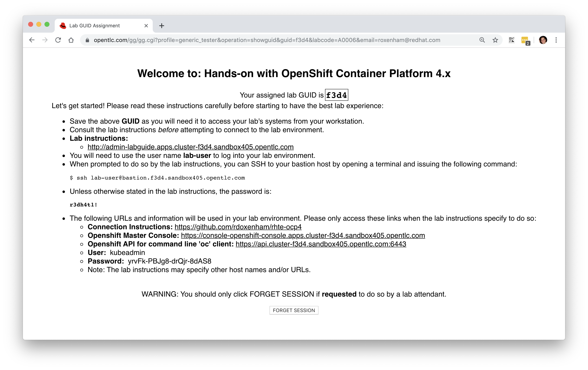

<h2>Hands-on with OpenShift 4.0 (SKO March 2019)</h2>

#**Lab Overview**

Firstly, welcome to the Red Hat Sales Kick Off 2019! The past few years have been an exciting time for both Red Hat and the OpenShift community; we've seen unprecedented interest and development in this new revolutionary technology and we're proud to be at the heart of it all. Red Hat is firmly committed to the future of OpenShift, Kubernetes, and the surrounding technologies; our goal is to continue to enhance the technology, make it more readily consumable and to enable our customers to be successful when using it.

We've prepared some materials to get you familiar with Red Hat OpenShift Container Platform 4.0, which is currently in a pre-release state (expected to be GA'd at Summit 2019 time frame as 4.1). This hands-on lab aims to get you, the attendees, a bit closer to Red Hat OpenShift Container Platform. It's comprised of a number of individual steps inside of this lab-guide that will run you through some of the more common tasks, such as investigation of the environment, application provisioning, network route creation, scaling the environment, and looking into over the air updates. We feel that giving you a hands-on overview of OpenShift will be a lot more beneficial than just delivering slideware. We want to make sure that you know how the components fit together, and how to use it. We will use a combination of command-line tools (oc) and interaction via the OpenShift Web Console.

Whilst you'll be asked to configure some fundamental components within OpenShift, you won't need to install OpenShift from scratch within this lab, we've provided a pre-installed environment with a multi-node configuration for each of you to use individually, which has been deployed via the new openshift-installer technology that was inspired by the Tectonic installer from the CoreOS acquisition. In the next steps you'll be walked through getting access to a dedicated environment that is just for you, and we'll start by exploring the environment.

If you have any problems at all or have any questions about Red Hat or our OpenShift offering, please put your hand-up and a lab moderator will be with you shortly to assist - we've asked many of our OpenShift experts to be here today, so please make use of their time. If you have printed materials, they're yours to take away with you, otherwise this online copy will be available for the foreseeable future; I hope that they'll be useful assets in your OpenShift endeavours.

> **NOTE**: If you've **not** already been provided with connection details or you do not have access to the mechanism we use to procure an environment (guidgrabber) please ask and we'll ensure that access is provided.

# Connecting

You'll need to use your own laptop to connect into your (public cloud hosted) dedicated environment, and hopefully the WiFi will sustain so many connections. It's on this environment that you'll perform the later lab instructions, and you should only need a web-browser to complete all of the tasks, although some of you may prefer to also use your own built in terminal.

> **NOTE**: Those of you completing this in China may not be able to use your own terminal sessions unless you're also connected to the Red Hat VPN, this is due to the restricted internet connectivity in the People's Republic of China. That's why we have a fall-back option of using the web-browser for everything, including the instructions where you need to use a terminal session; this will become more obvious later down the line.

To get started, we need to request your own dedicated session, for this we use a tool from GPTE called GuidGrabber. Open up your web-browser and click [here](https://www.opentlc.com/gg/gg.cgi?profile=generic_sko). What you should see is as follows, noting that if there's more than one lab shown in the drop-down box ensure you select **'lab1 - OpenShift 4.0 Sandbox'** and have entered the activation key '**sko2019**', which you will need to do too:

This will allocate a pre-deployed session for your usage with a **GUID** that's used to uniquely identify your session. Here's an example below:

You'll see that my assigned lab GUID is '**dd83**' and is used to uniquely identify my session, and is used as part of the connection address. There are a number of links that are displayed that we'll be using over the next few sections, e.g. a link to the OpenShift web-console along with credentials that you will need. 

> **NOTE**: If there are no credentials listed, use "**admin**" / "**r3dh4t1!**" for the username/password.

Next, let's login to the web-console and ensure that it's working as expected. Click on the link that says "**OpenShift Master Console**" from within the GuidGrabber webpage. After a couple of SSL errors (that you'll need to manually accept) you should be presented with the login page:

The environment takes around 20 minutes to power-up, and this should have already been done for you prior to the session starting, but don't be alarmed if you cannot connect in straight away, it may just require a few more minutes. Once it's up and running, proceed to login with the username and password that were provided to you once you requested your environment and you should hit the OpenShift console home page:

Now we're ready to proceed with the rest of our lab steps. If you had any problems getting access or if you have any questions, please feel free to ask any of the moderators at any time. If you lose your connection details you can return [here](https://www.opentlc.com/gg/gg.cgi?profile=generic_sko) at any time.

# Deploying the Web Terminal

In this section we're going to both deploying our first application, but also creating a web-browser based terminal session hosted by the OpenShift cluster that we'll be interacting with. We're doing this for two reasons, firstly to give you an experience of deploying a basic OpenShift application but also to avoid any connectivity or client issues you may be facing, depending on your geographical location or your local system configurations. We have a dedicated image that we'll deploy that has been pre-configured with everything we'll need, let's deploy that now.

Assuming that you've already logged into your environment via the web-browser, follow these instructions to deploy the application:

1. On the left-hand side menu, select '**Workloads**', and then select '**Pods**'.

2. Ensure that you're in the '**default**' project by selecting it from the drop down menu on the left of the 'pods' panel.

3. You should see that there's no current pods running in the 'default' project.

4. In the top-right, click the '**Add**' drop-down menu and select '**Deploy Image**' as shown here:

	
	
5. In this new pane, ensure that the '**Namespace**' is also set to '**default**'

6. Enter "**quay.io/openshiftlabs/workshop-terminal:2.4.0**" in the '**Image Name**' box, noting that there's no "http://", enter exactly as shown here, without the quotes, and then select the magnifying glass to the right of the box, this will show you more information about the image.

	

7. Leave 'workshop-terminal' as the name for the image, we don't need to change that.

8. Scroll down a bit and provide an environment variable. We need to set "OC_VERSION" to be "4.0" here as shown below:

	

9. When you're done, click '**Deploy**'

10. You will then be presented with a list of your applications, in there select 'workshop-terminal' and you will be able to watch the deployment and await the pod to start, as below.

	

11. Next we need to create a route so we can access this application from the outside of OpenShift (i.e. from the internet). On the left-hand side menu, select '**Networking**' and then choose '**Routes**'. In the new pane select '**Create Route**' in the top-left.

12. Enter '**workshop-terminal**' for the name of the route, leave the hostname and path the default, select '**workshop-terminal**' from the list of services in the '**Service**' menu, and select the only port in the '**Target Port**' drop down (should be port 10080 --> 10080), like this:

	

13. When you're ready, click '**Create**' at the bottom and it will create the route for us.

14. You will now be presented with a pane that shows the overview of the route that we requested:

 	
 	
15. In the top right hand side you will see the '**Location**' which will be the routable URL that will provide access to our workshop terminal. Click on this and you should now see the in-browser terminal session that we can use (if preferred, or mandated due to connectivity issues):

	

Congratulations! You've just deployed your first application on OpenShift 4.0. You can jump into seeing more information about it by going into the '**Deployment Configs**' menu from the '**Workloads**' drop down on the main menu on the left-hand side. Feel free to have a play around and investigate some of the resources that have been created along with the logs from the deployment.

> **NOTE**: With OpenShift's integration with Amazon Web Services, when we create a route through the API or web-console, Amazon's Route 53 DNS service is dynamically updated for us, part of the key work we're doing to standardise the user experience across multiple different underlying platforms by abstracting the underlying functionality and complexity. 
