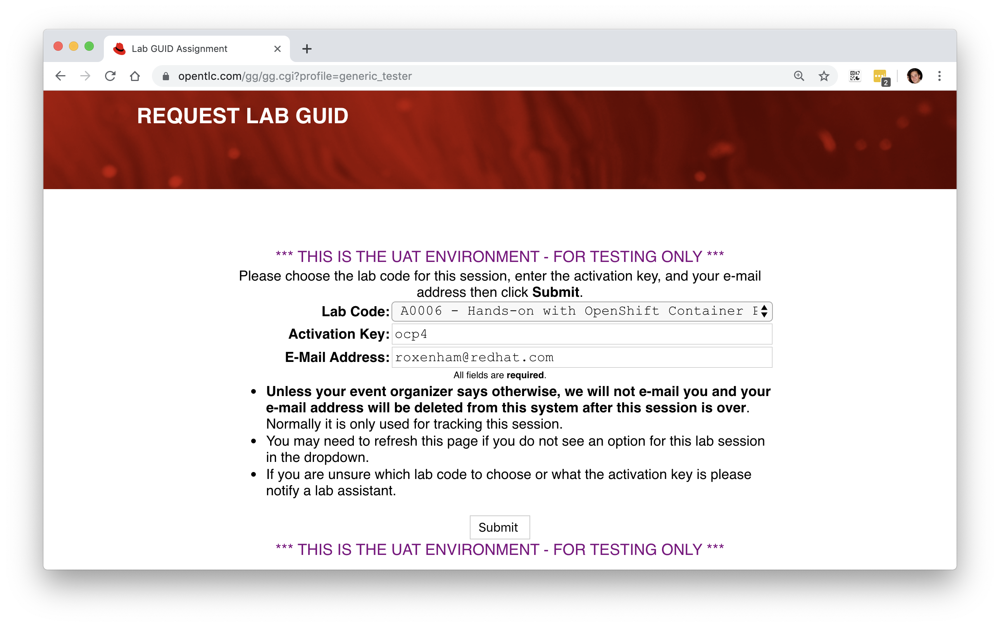

<h2>Hands-on with OpenShift Container Platform 4.x</h2>

#**Connecting**

You'll need to use your own laptop to connect into your (public cloud hosted) dedicated environment - hopefully the WiFi will sustain so many connections :-). It's on this environment that you'll perform the later lab instructions, and you should only need to use your terminal emulator and a web-browser to complete all of the tasks.

To get started, we need to request your own dedicated session, for this we use a tool from GPTE called GuidGrabber... in your web browser open [this link](https://www.opentlc.com/gg/gg.cgi?profile=generic_rhte) (https://www.opentlc.com/gg/gg.cgi?profile=generic_rhte). What you should see is as follows, noting that if there's more than one lab shown in the drop-down box ensure you select **'A0006 - Hands on with OpenShift Container Platform 4.x'** and have entered the activation key '**ocp4**', along with your own email address:

When you hit **Submit** it will allocate a pre-deployed session for your usage with a **GUID** that's used to uniquely identify your session. Here's an example below:

You'll see that my assigned lab GUID is '**f3d4**' and is used to uniquely identify my session, and makes up part of the address you'll need to connect to in the next steps. ***DO NOT SHARE THIS, IT'S UNIQUE TO YOU.***

The environment takes around 20 minutes to power-up, and this should have already been done for you prior to the session starting, but don't be alarmed if you cannot connect in straight away, it may just require a few more minutes.

Now we're ready to proceed with the rest of our lab steps. If you had any problems getting access or if you have any questions, please feel free to ask any of the moderators at any time. If you lose your connection details you can return [here](https://www.opentlc.com/gg/gg.cgi?profile=generic_rhte) at any time.

> **NOTE**: If you've **not** already been provided with connection details or you do not have access to the mechanism we use to procure an environment (**guidgrabber**) please ask and we'll ensure that access is provided.

#**Getting Started**

In the GuidGrabber output you'll see a link to the lab-instructions that are hosted on the OpenShift cluster itself, simply hit this link, and you'll be asked to login to OpenShift:

The credentials are listed in the GuidGrabber page; the username is always "**kubeadmin**", but the password is randomly generated. Use these credentials to log-in, allow the permissions, and then follow the lab guide instructions, which should look like the following:

> **NOTE**: You will need to accept some self-signed certificates in your browser.

Good luck, and let us know if we can help you.

