<h2>Hands-on Training with OpenShift 4.1 (Self-paced) - August 2019</h2>

**Authors**:

First edition:

* Rhys Oxenham <<roxenham@redhat.com>>
* Erik Jacobs <<ejacobs@redhat.com>>
* James Falkner <<jfalkner@redhat.com>>

Update to 4.1:

* Jacob Liberman <<jliberma@redhat.com>>


#**Lab Overview**

Firstly, welcome to the hands-on technical training for OpenShift 4! The past few years have been an exciting time for both Red Hat and the OpenShift community; we've seen unprecedented interest and development in this new revolutionary technology and we're proud to be at the heart of it all. Red Hat is firmly committed to the future of OpenShift, Kubernetes, and the surrounding technologies; our goal is to continue to enhance the technology, make it more readily consumable and to enable our customers to be successful when using it.

We've prepared some materials to get you familiar with Red Hat OpenShift Container Platform 4.0, which is currently in a pre-release state (expected to be GA'd at Summit 2019 time frame as 4.1). This hands-on lab aims to get you a bit closer to Red Hat OpenShift Container Platform. It's comprised of a number of individual steps inside of this lab-guide that will run you through some of the more common tasks, such as investigation of the environment, application provisioning, network route creation, scaling the environment, and looking into over the air updates. We feel that giving you a hands-on overview of OpenShift will be a lot more beneficial than just delivering slideware. We want to make sure that you know how the components fit together, and how to use it. We will use a combination of command-line tools (oc) and interaction via the OpenShift Web Console.

Whilst you'll be asked to configure some fundamental components within OpenShift, you won't need to install OpenShift from scratch within this lab, we've provided a pre-installed environment with a multi-node configuration for each of you to use individually, which has been deployed via the new openshift-installer technology that was inspired by the Tectonic installer from the CoreOS acquisition. In the next steps you'll be walked through getting access to a dedicated environment that is just for you, and we'll start by exploring the environment.

If you have any problems at all or have any questions about Red Hat or our OpenShift offering, please get in touch with the [Field & Customer Engagement team](mailto:field-engagement@redhat.com), and we'll be happy to provide timely assistance. These materials will continue to be updated over time as we add additional features and components, and we're always glad for pull-requests if you think something should be added, or you spot a typo. We hope that this guide will become a useful asset in your OpenShift endeavours.

# Connecting

We're using the Red Hat Product Demo Suite (RHPDS) for our labs, and therefore we need to request and get access to a unique environment based within the public cloud for you to use to complete the lab steps. If you're a Red Hat employee you'll need to follow these instructions to generate a session, othewise please get the connection details from your Red Hat representative and skip to the next section below.

> **NOTE**: Only proceed with the RHPDS creation instructions below if you're a Red Hat employee, or have been given access to RHPDS as a partner.

First you'll need to request a session via RHPDS, the WebUI (and associated login page) can be found at [https://rhpds.redhat.com/](https://rhpds.redhat.com/):


Once you've logged in (if you don't have an account you **need** to register [here](https://account.opentlc.com/account/requestAccessForm.php)), navigate to the service catalogue by selecting '**Services**' --> '**Catalogs**', then navigate to the correct lab which is in '**OpenShift Demos**' and '**OpenShift 4 Preview**' which should look like the following:

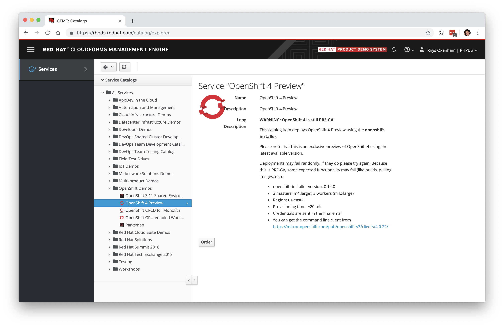

Once you select '**Order**' you'll be presented with the following page which you'll need to accept some terms about the order time and the expiry (by selecting the check-box):

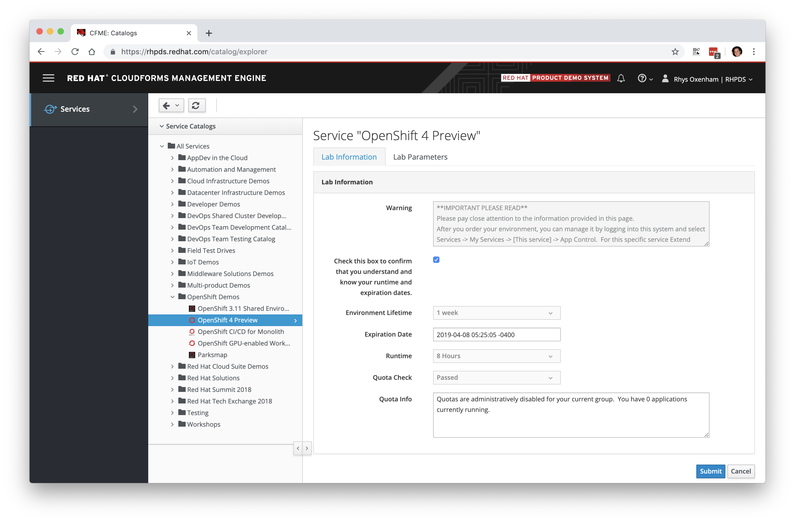

Select **'Submit'** at the bottom of the page and it should generate the environment for you, and will show up in your requests:

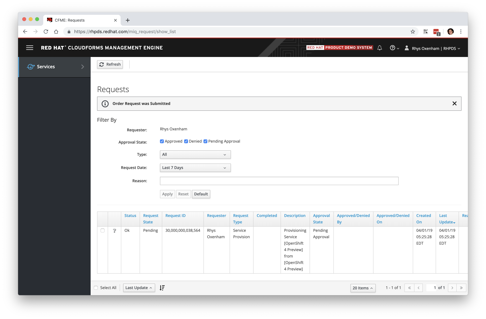

The RHPDS system will now generate a unique environment for you to use; this will take some time as it needs to provision all of the AWS instances, run the new openshift-installer, and then finally send you an email with some of the connection details (although expect a series of emails updating you with the progress). This process typically takes around 45minutes, so be prepared to wait around. The details that you'll be sent uniquely identify your session, see here for an example:

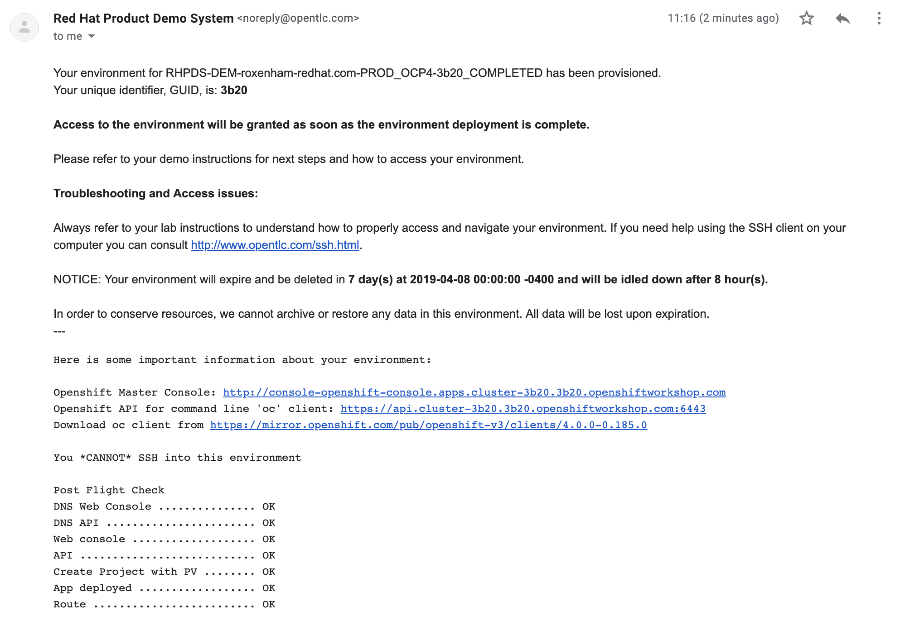

You'll notice that it contains some links, specifically the "**OpenShift Master Console**" (i.e. the web console for OpenShift) and the "**OpenShift API**" which is the endpoint for the 'oc' client. In addition, there's some information around the expiry of the lab; please remember that Red Hat are paying the bill for these instances, so when you've finished with this lab please retire the deployment in RHPDS... '**Services**' --> '**My Services**' --> '**Lifecycle**' --> '**Retire this Service**', but only do this once you've finished!

# Verifying Connectivity

Next, let's login to the web-console and ensure that it's working as expected. Click on the link that says "**OpenShift Master Console**" from within the email from RHPDS. After a couple of SSL errors (that you'll need to manually accept) you should be presented with the login page:

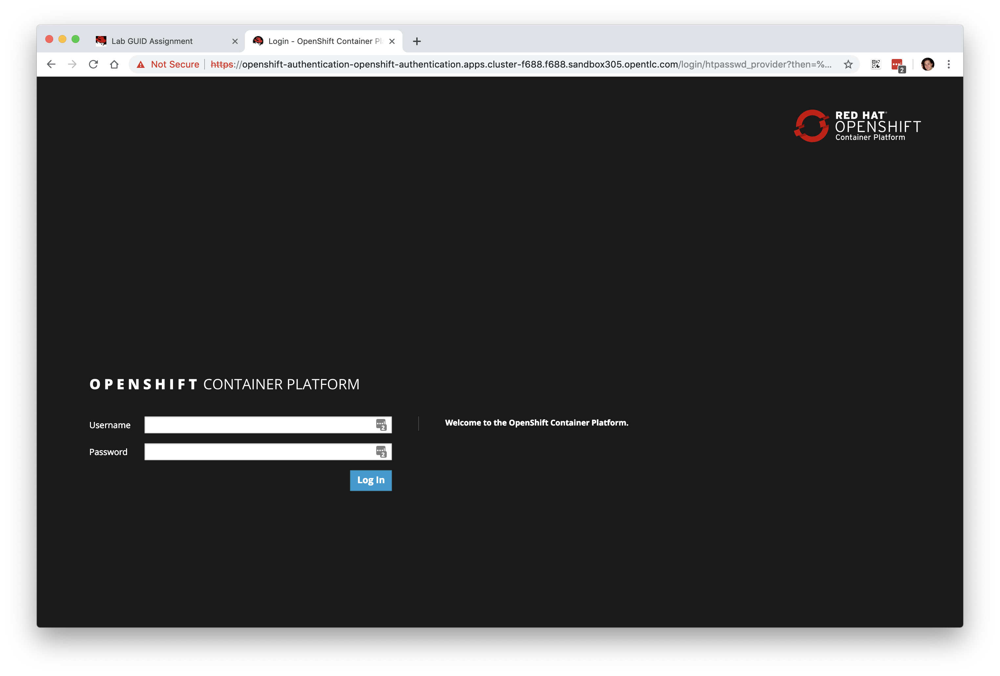

The environment takes around 20 minutes to power-up, and this should have already been done for you prior to the session starting, but don't be alarmed if you cannot connect in straight away, it may just require a few more minutes. Once it's up and running, proceed to login with the username and password that were provided to you once you requested your environment and you should hit the OpenShift console home page:

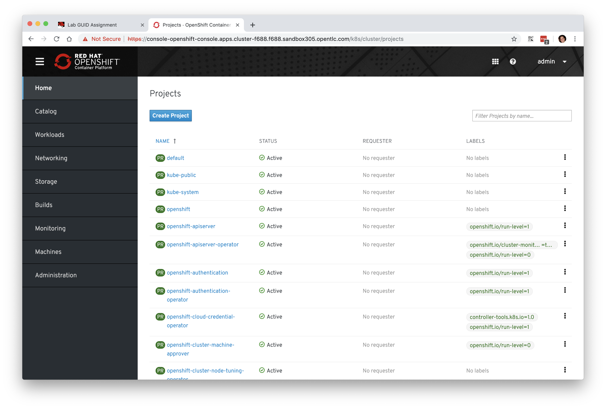

Now we're ready to proceed with the rest of our lab steps. If you had any problems getting access or if you have any questions, please feel free to ask any of the moderators at any time. If you lose your connection details you can refer to your RHPDS email at any time.

# Deploying the Web Terminal

In this section we're going to both deploying our first application, but also creating a web-browser based terminal session hosted by the OpenShift cluster that we'll be interacting with. We're doing this for two reasons, firstly to give you an experience of deploying a basic OpenShift application but also to avoid any connectivity or client issues you may be facing, depending on your geographical location or your local system configurations. We have a dedicated image that we'll deploy that has been pre-configured with everything we'll need, let's deploy that now.

Assuming that you've already logged into your environment via the web-browser, follow these instructions to deploy the application:

1. On the left-hand side menu, select '**Workloads**', and then select '**Pods**'.

2. Ensure that you're in the '**default**' project by selecting it from the drop down menu on the left of the 'pods' panel.

3. You should see that there's no current pods running in the 'default' project.

4. In the top-right, click the '**Add**' drop-down menu and select '**Deploy Image**' as shown here:

	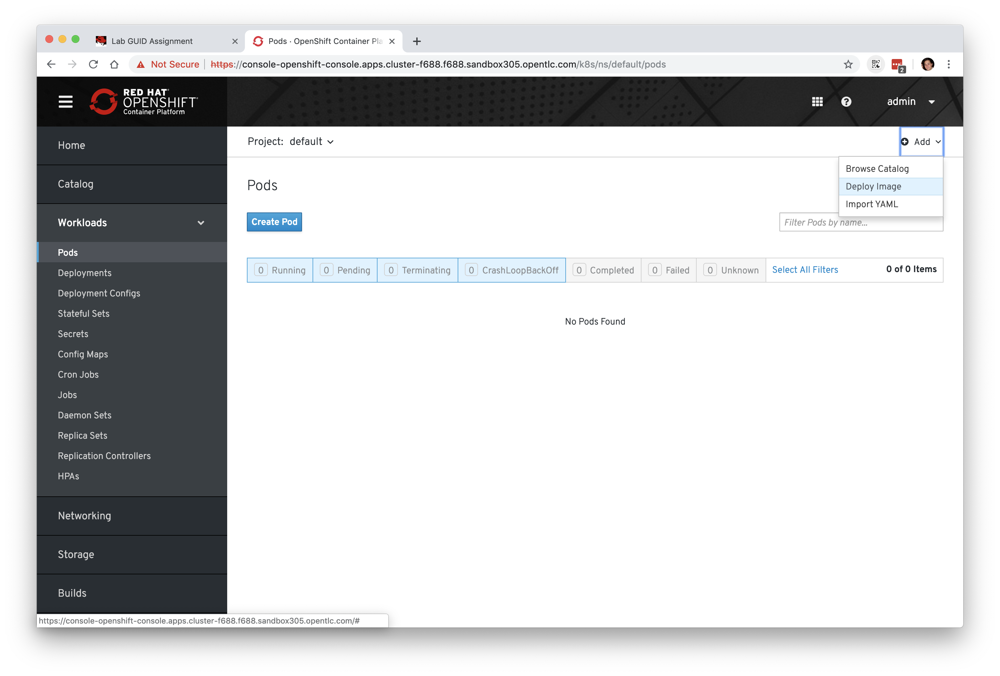
	
5. In this new pane, ensure that the '**Namespace**' is also set to '**default**'

6. Enter "**quay.io/openshiftlabs/workshop-terminal:2.4.0**" in the '**Image Name**' box, noting that there's no "http://", enter exactly as shown here, without the quotes, and then select the magnifying glass to the right of the box, this will show you more information about the image.

	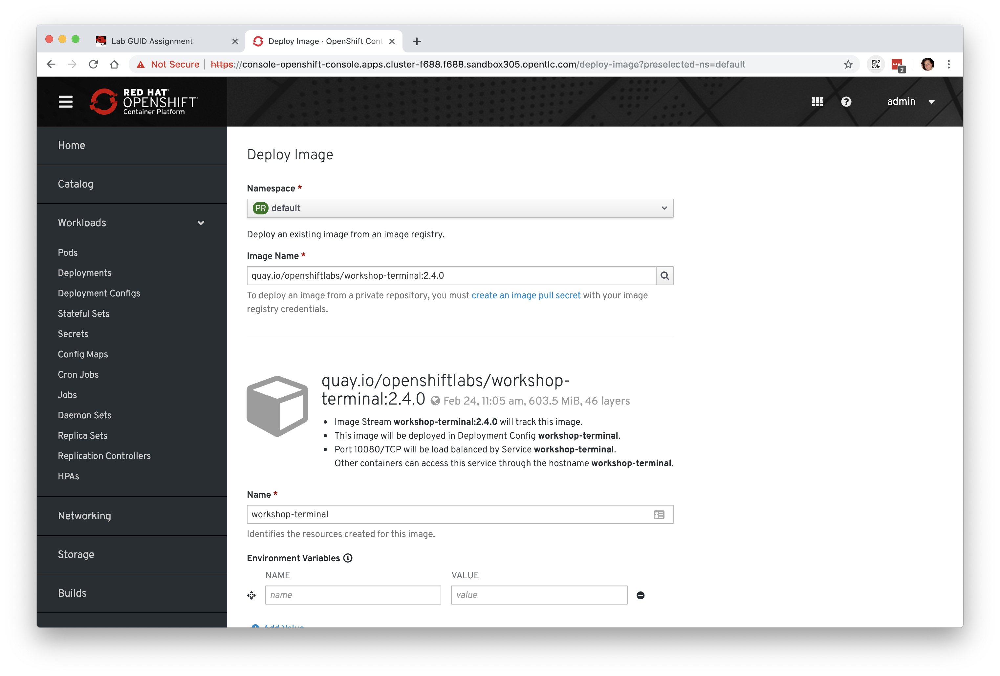

7. Leave 'workshop-terminal' as the name for the image, we don't need to change that.

8. Scroll down a bit and provide an environment variable. We need to set "OC_VERSION" to be "4.0" here as shown below:

	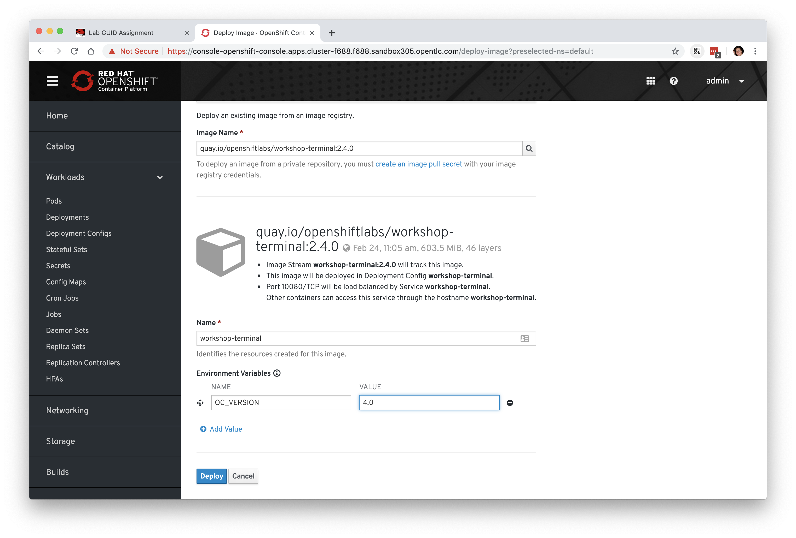

9. When you're done, click '**Deploy**'

10. You will then be presented with a list of your applications, in there select 'workshop-terminal' and you will be able to watch the deployment and await the pod to start, as below.

	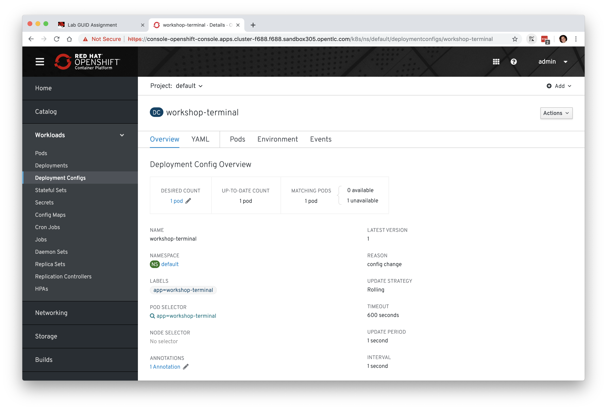

11. Next we need to create a route so we can access this application from the outside of OpenShift (i.e. from the internet). On the left-hand side menu, select '**Networking**' and then choose '**Routes**'. In the new pane select '**Create Route**' in the top-left.

12. Enter '**workshop-terminal**' for the name of the route, leave the hostname and path the default, select '**workshop-terminal**' from the list of services in the '**Service**' menu, and select the only port in the '**Target Port**' drop down (should be port 10080 --> 10080), like this:

	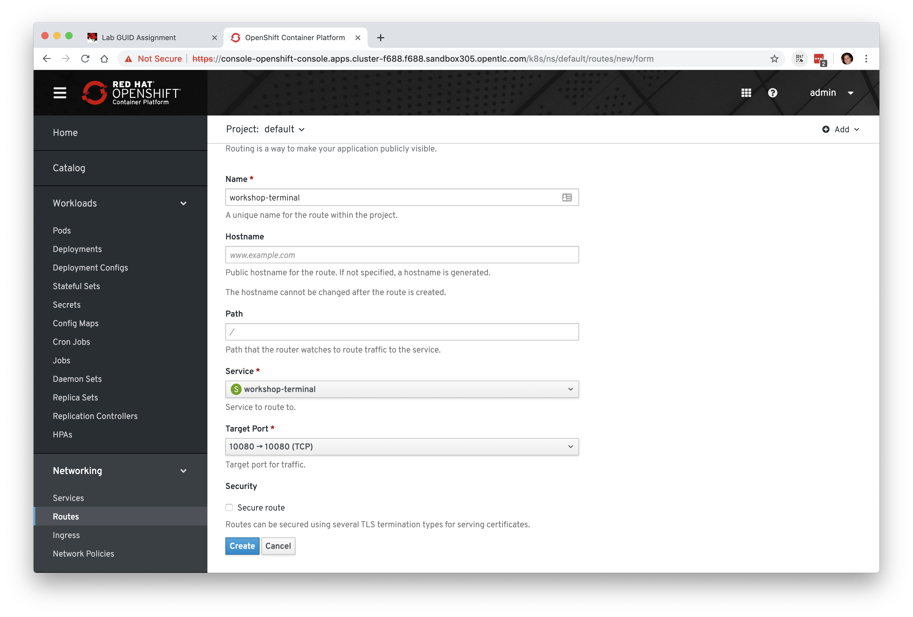

13. When you're ready, click '**Create**' at the bottom and it will create the route for us.

14. You will now be presented with a pane that shows the overview of the route that we requested:

 	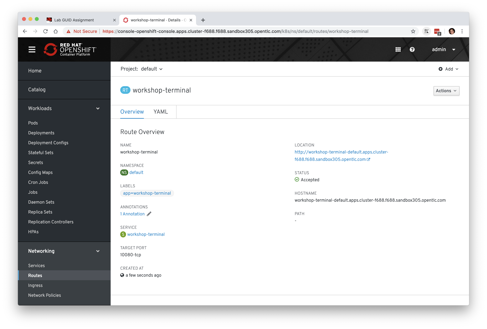
 	
15. In the top right hand side you will see the '**Location**' which will be the routable URL that will provide access to our workshop terminal. Click on this and you should now see the in-browser terminal session that we can use (if preferred, or mandated due to connectivity issues):

	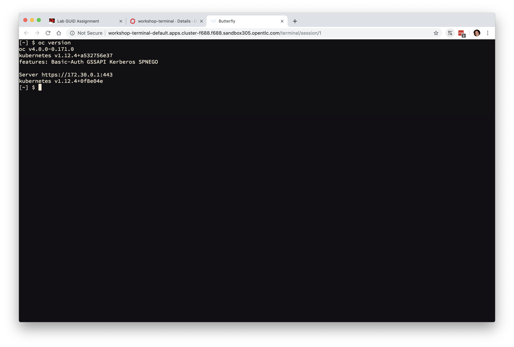

Congratulations! You've just deployed your first application on OpenShift 4.0. You can jump into seeing more information about it by going into the '**Deployment Configs**' menu from the '**Workloads**' drop down on the main menu on the left-hand side. Feel free to have a play around and investigate some of the resources that have been created along with the logs from the deployment.

> **NOTE**: With OpenShift's integration with Amazon Web Services, when we create a route through the API or web-console, Amazon's Route 53 DNS service is dynamically updated for us, part of the key work we're doing to standardise the user experience across multiple different underlying platforms by abstracting the underlying functionality and complexity.

# Exploring the Cluster

Let's take some time to explore our new cluster. You now have two options, you can use your local terminal on your laptop, or you can use the browser-based terminal that we provisioned in the previous section. Due to connectivity challenges, especially in China, you may be forced to use the browser-based one, and for convenience our recommendation would be to use it. If you **really** want to configure your **local** client you can do so by using the following instructions to download the command line tooling. You should **only** do this if you don't want to use the browser-based terminal; make sure you run this on your local laptop and NOT within the web-browser.

For Linux:

~~~bash
$ wget https://mirror.openshift.com/pub/openshift-v3/clients/4.0.0-0.148.0/linux/oc.tar.gz
(...)
$ tar -zxvf oc.tar.gz
oc

$ export PATH=$PATH:$(pwd)
$ oc version
oc v4.0.0-0.148.0
kubernetes v1.11.0+8868a98a7b
features: Basic-Auth GSSAPI Kerberos SPNEGO
~~~

For MacOS:

~~~bash
$ wget https://mirror.openshift.com/pub/openshift-v3/clients/4.0.0-0.148.0/macosx/oc.tar.gz
(...)
$ tar -zxvf oc.tar.gz
x oc

$ export PATH=$PATH:$(pwd)
$ oc version
oc v4.0.0-0.148.0
kubernetes v1.11.0+8868a98a7b
features: Basic-Auth GSSAPI Kerberos SPNEGO
~~~

> **NOTE**: For all remaining command line instructions below, either use your local system that you've downloaded the command line tooling on, or use the web-browser session we deployed earlier.

Let's now configure our command line tooling to point to our new cluster. You will find all of the connection details as well as authentication credentials on the GuidGrabber page from earlier where you acquired your unique session information. Below you'll need to enter the API URI, which will be shown as the "**Openshift API for command line 'oc' client**" on the GuidGrabber page:

~~~bash
$ oc login --server <your API URI>

The server uses a certificate signed by an unknown authority.
You can bypass the certificate check, but any data you send to the server could be intercepted by others.
Use insecure connections? (y/n): y

Authentication required for https://api.beta-190305-1.ocp4testing.openshiftdemos.com:6443 (openshift)
Username: <your username>
Password: <your password>
Login successful.
(...)

Using project "default".
Welcome! See 'oc help' to get started.
~~~

You can now check that your config has been written successfully:

~~~bash
$ cat ~/.kube/config
apiVersion: v1
clusters:
- cluster:
    insecure-skip-tls-verify: true
    server: https://api.beta-190305-1.ocp4testing.openshiftdemos.com:6443
(...)
~~~

> **NOTE**: Your output will vary slightly from the above, you'll just need to
make sure to use the API endpoint and credentials that you were provided with.

Now that your cluster is installed, you will have access to the web console and
can use the CLI. Below are some command-line exercises to explore the cluster.

## Cluster Nodes

The default installation behavior creates 6 nodes: 3 masters and 3 "worker"
application/compute nodes. You can view them with:

~~~bash
$ oc get nodes -o wide
NAME                           STATUS    ROLES     AGE       VERSION              INTERNAL-IP    EXTERNAL-IP   OS-IMAGE                          KERNEL-VERSION              CONTAINER-RUNTIME
ip-10-0-137-104.ec2.internal   Ready     worker    24h       v1.12.4+5dc94f3fda   10.0.137.104   <none>        Red Hat CoreOS 400.7.20190301.0   3.10.0-957.5.1.el7.x86_64   cri-o://1.12.6-1.rhaos4.0.git2f0cb0d.el7
ip-10-0-140-138.ec2.internal   Ready     master    24h       v1.12.4+5dc94f3fda   10.0.140.138   <none>        Red Hat CoreOS 400.7.20190301.0   3.10.0-957.5.1.el7.x86_64   cri-o://1.12.6-1.rhaos4.0.git2f0cb0d.el7
ip-10-0-158-222.ec2.internal   Ready     master    24h       v1.12.4+5dc94f3fda   10.0.158.222   <none>        Red Hat CoreOS 400.7.20190301.0   3.10.0-957.5.1.el7.x86_64   cri-o://1.12.6-1.rhaos4.0.git2f0cb0d.el7
ip-10-0-159-179.ec2.internal   Ready     worker    24h       v1.12.4+5dc94f3fda   10.0.159.179   <none>        Red Hat CoreOS 400.7.20190301.0   3.10.0-957.5.1.el7.x86_64   cri-o://1.12.6-1.rhaos4.0.git2f0cb0d.el7
ip-10-0-168-43.ec2.internal    Ready     master    24h       v1.12.4+5dc94f3fda   10.0.168.43    <none>        Red Hat CoreOS 400.7.20190301.0   3.10.0-957.5.1.el7.x86_64   cri-o://1.12.6-1.rhaos4.0.git2f0cb0d.el7
ip-10-0-171-135.ec2.internal   Ready     worker    24h       v1.12.4+5dc94f3fda   10.0.171.135   <none>        Red Hat CoreOS 400.7.20190301.0   3.10.0-957.5.1.el7.x86_64   cri-o://1.12.6-1.rhaos4.0.git2f0cb0d.el7
~~~

If you want to see the various applied **labels**, you can also do:

~~~bash
$ oc get nodes --show-labels
NAME                           STATUS    ROLES     AGE       VERSION              LABELS
ip-10-0-137-104.ec2.internal   Ready     worker    23h       v1.12.4+5dc94f3fda   beta.kubernetes.io/arch=amd64,beta.kubernetes.io/instance-type=m4.large,beta.kubernetes.io/os=linux,failure-domain.beta.kubernetes.io/region=us-east-1,failure-domain.beta.kubernetes.io/zone=us-east-1a,kubernetes.io/hostname=ip-10-0-137-104,node-role.kubernetes.io/worker=
ip-10-0-140-138.ec2.internal   Ready     master    23h       v1.12.4+5dc94f3fda   beta.kubernetes.io/arch=amd64,beta.kubernetes.io/instance-type=m4.xlarge,beta.kubernetes.io/os=linux,failure-domain.beta.kubernetes.io/region=us-east-1,failure-domain.beta.kubernetes.io/zone=us-east-1a,kubernetes.io/hostname=ip-10-0-140-138,node-role.kubernetes.io/master=
ip-10-0-158-222.ec2.internal   Ready     master    23h       v1.12.4+5dc94f3fda   beta.kubernetes.io/arch=amd64,beta.kubernetes.io/instance-type=m4.xlarge,beta.kubernetes.io/os=linux,failure-domain.beta.kubernetes.io/region=us-east-1,failure-domain.beta.kubernetes.io/zone=us-east-1b,kubernetes.io/hostname=ip-10-0-158-222,node-role.kubernetes.io/master=
ip-10-0-159-179.ec2.internal   Ready     worker    23h       v1.12.4+5dc94f3fda   beta.kubernetes.io/arch=amd64,beta.kubernetes.io/instance-type=m4.large,beta.kubernetes.io/os=linux,failure-domain.beta.kubernetes.io/region=us-east-1,failure-domain.beta.kubernetes.io/zone=us-east-1b,kubernetes.io/hostname=ip-10-0-159-179,node-role.kubernetes.io/worker=
ip-10-0-168-43.ec2.internal    Ready     master    23h       v1.12.4+5dc94f3fda   beta.kubernetes.io/arch=amd64,beta.kubernetes.io/instance-type=m4.xlarge,beta.kubernetes.io/os=linux,failure-domain.beta.kubernetes.io/region=us-east-1,failure-domain.beta.kubernetes.io/zone=us-east-1c,kubernetes.io/hostname=ip-10-0-168-43,node-role.kubernetes.io/master=
ip-10-0-171-135.ec2.internal   Ready     worker    23h       v1.12.4+5dc94f3fda   beta.kubernetes.io/arch=amd64,beta.kubernetes.io/instance-type=m4.large,beta.kubernetes.io/os=linux,failure-domain.beta.kubernetes.io/region=us-east-1,failure-domain.beta.kubernetes.io/zone=us-east-1c,kubernetes.io/hostname=ip-10-0-171-135,node-role.kubernetes.io/worker=
~~~

For reference, **labels** are used as a mechanism to tag certain information
onto a node, or a set of nodes, that can help you identify your systems, e.g.
by operating system, system architecture, specification, location of the system
(e.g. region), it's hostname, etc. They can also help with application
scheduling, e.g. make sure that my application (or pod) resides on a specific
system type. The labels shown above are utilising the default labels, but it's
possible to set some custom labels in the form of a key-value pair.

## The Cluster Operator

The cluster version operator is the core of what defines an OpenShift deployment
. The cluster version operator pod(s) contains the set of manifests which are
used to deploy, updated, and/or manage the OpenShift services in the cluster.
This operator ensures that the other services, also deployed as operators, are
at the version which matches the release definition and takes action to remedy
discrepancies when necessary.

~~~bash
$ oc get deployments -n openshift-cluster-version
NAME                       DESIRED   CURRENT   UP-TO-DATE   AVAILABLE   AGE
cluster-version-operator   1         1         1            1           2h
~~~

You can also view the current version of the OpenShift cluster and give you
a high-level indication of the status:

~~~bash
$ oc get clusterversion
NAME      VERSION     AVAILABLE   PROGRESSING   SINCE   STATUS
version   4.0.0-0.7   True        False         28h     Cluster version is 4.0.0-0.7
~~~

If you want to review a list of operators that the cluster version operator is
controlling, along with their status, you can ask for a list of the cluster
operators:

~~~bash
$ oc get clusteroperator
NAME                                  VERSION   AVAILABLE   PROGRESSING   FAILING   SINCE
cluster-autoscaler                              True        False         False     29h
cluster-storage-operator                        True        False         False     29h
console                                         True        False         False     28h
dns                                             True        False         False     29h
image-registry                                  True        False         False     29h
ingress                                         True        False         False     28h
kube-apiserver                                  True        False         False     29h
kube-controller-manager                         True        False         False     29h
kube-scheduler                                  True        False         False     29h
machine-api                                     True        False         False     29h
machine-config                                  True        False         False     17h
marketplace-operator                            True        False         False     29h
monitoring                                      True        False         False     80m
network                                         True        False         False     81m
node-tuning                                     True        False         False     28h
openshift-apiserver                             True        False         False     81m
openshift-authentication                        True        False         False     29h
openshift-cloud-credential-operator             True        False         False     29h
openshift-controller-manager                    True        False         False     29h
openshift-samples                               True        False         False     29h
operator-lifecycle-manager                      True        False         False     29h
~~~

Or a more comprehensive way of getting a list of operators running on the
cluster, along with the link to the code, the documentation, and the commit that
provided the functionality is as follows:

~~~bash
$ oc adm release info --commits
Name:      4.0.0-0.7
Digest:    sha256:641c0e4f550af59ec20349187a31751ae5108270f13332d1771935520ebf34c1
Created:   2019-03-05 18:33:12 +0000 GMT
OS/Arch:   linux/amd64
Manifests: 248

Release Metadata:
  Version:  4.0.0-0.7
  Upgrades: 4.0.0-0.6
  Metadata:
    description: Beta 2

Images:
  NAME                                          REPO                                                                       COMMIT
  aws-machine-controllers                       https://github.com/openshift/cluster-api-provider-aws                      17d5aacdeb2df8898b20286970ace7d42f0c376a
  cli                                           https://github.com/openshift/ose                                           e268aada53a27b7cba51e4267d035dad207a1d8a
  cloud-credential-operator                     https://github.com/openshift/cloud-credential-operator                     97e00568622e2a82cde1e964be7ea7c37fe85b4f
  cluster-authentication-operator               https://github.com/openshift/cluster-authentication-operator               88650bd64069ed79a411098b481ac2416526ce0e
  cluster-autoscaler                            https://github.com/openshift/kubernetes-autoscaler                         e1a6a0960a100132abc5f8398ff73dbb0f45ae28
  cluster-autoscaler-operator                   https://github.com/openshift/cluster-autoscaler-operator                   0c2284a7a7cff0e123ace8d5e43337e4cc9739e9
  cluster-bootstrap                             https://github.com/openshift/cluster-bootstrap                             90a38fd8d9dc0b0a61214f079fd4734b034bae0c
  cluster-config-operator                       https://github.com/openshift/cluster-config-operator                       aa1805e73138deabbfa57772170f310e2f3097cd
  cluster-dns-operator                          https://github.com/openshift/cluster-dns-operator                          e4aa0a50f865e8399aeeccaf8c24f8d891cd67c2
  cluster-image-registry-operator               https://github.com/openshift/cluster-image-registry-operator               689aa65b90644aead5b579acce2725a08bd70f93
  cluster-ingress-operator                      https://github.com/openshift/cluster-ingress-operator                      e53dfea77b35656f105c41d5c1a3bcb2bc6fbcba
  cluster-kube-apiserver-operator               https://github.com/openshift/cluster-kube-apiserver-operator               4c34fbfd2b4382e366d45f5e9acd07fb8da1ee9d
  cluster-kube-controller-manager-operator      https://github.com/openshift/cluster-kube-controller-manager-operator      52a2f710ae90f0624c47040bf6d9b0ad55538de0
  cluster-kube-scheduler-operator               https://github.com/openshift/cluster-kube-scheduler-operator               c68e8b1af27033dec9ca9cd36c831b0796cef798
  cluster-machine-approver                      https://github.com/openshift/cluster-machine-approver                      c4ba3024437a348a03ee1459cdf9823d7c6de4a8
  cluster-monitoring-operator                   https://github.com/openshift/cluster-monitoring-operator                   25fd008f1fb34cc27332fcc59f6821ef01c306a6
  cluster-network-operator                      https://github.com/openshift/cluster-network-operator                      b13c79c1ae6290bbc472c0ac260855e26d71dfd3
  cluster-node-tuned                            https://github.com/openshift/openshift-tuned                               b580cb6f52a0e352aebbe0e368d5ec020230c532
  cluster-node-tuning-operator                  https://github.com/openshift/cluster-node-tuning-operator                  900d59d3aa7a59aa31318bc25efc5df1e994e4b9
  cluster-openshift-apiserver-operator          https://github.com/openshift/cluster-openshift-apiserver-operator          0a65fe40a74cfc6114fdaa30e2b2c24924509cda
  cluster-openshift-controller-manager-operator https://github.com/openshift/cluster-openshift-controller-manager-operator 6656fd894295a9924c6bf5de244586705508e595
  cluster-samples-operator                      https://github.com/openshift/cluster-samples-operator                      204cf2ba6a3a12d2344f69d19f539ebc31f39683
  cluster-storage-operator                      https://github.com/openshift/cluster-storage-operator                      b850242280b7ef2cf7631952229c0a438ec39e64
  cluster-svcat-apiserver-operator              https://github.com/openshift/cluster-svcat-apiserver-operator              547648cb7b3f2a0d8f049f680c18ac66cd339b3f
  cluster-svcat-controller-manager-operator     https://github.com/openshift/cluster-svcat-controller-manager-operator     9261f420a3db9556606c8ee0980a5e02a8f28d89
  cluster-version-operator                      https://github.com/openshift/cluster-version-operator                      bcf8bf290bc7d0090769b4722831dbb157b75d01
  configmap-reloader                            https://github.com/openshift/configmap-reload                              3c2f85724078cbf7ffab56886ff32d677c386afe
  console                                       https://github.com/openshift/console                                       24942e86dd5bef0b17c1e33bfcd386b450c49b19
  console-operator                              https://github.com/openshift/console-operator                              8665600274308fbda0f66e7ed8a0e5cc5c0bb7d9
  container-networking-plugins-supported        https://github.com/openshift/ose-containernetworking-plugins               f6a58dcec62ca740305a58a0a6b008c5e57b8943
  container-networking-plugins-unsupported      https://github.com/openshift/ose-containernetworking-plugins               f6a58dcec62ca740305a58a0a6b008c5e57b8943
  coredns                                       https://github.com/openshift/coredns                                       fbcb8252a1bab3d32ecf2dd3307f798aacd0280e
  deployer                                      https://github.com/openshift/ose                                           e268aada53a27b7cba51e4267d035dad207a1d8a
  docker-builder                                https://github.com/openshift/builder                                       1a77d837d8d74d5dcb6f8afcadb082629b04883e
  docker-registry                               https://github.com/openshift/image-registry                                afcc7daa5eeeb6a77754ae86decefade83314189
  etcd                                          https://github.com/openshift/etcd                                          a0e62b48f8db8572c129fa3d3507c7ce118ab650
  grafana                                       https://github.com/openshift/grafana                                       2ea5517e5d33531ee8b838c70666e484a79cd49d
  haproxy-router                                https://github.com/openshift/router                                        80b8c3d8e67e7549c59957421db2a5d344d8796a
  hyperkube                                     https://github.com/openshift/ose                                           e268aada53a27b7cba51e4267d035dad207a1d8a
  hypershift                                    https://github.com/openshift/ose                                           e268aada53a27b7cba51e4267d035dad207a1d8a
  installer                                     https://github.com/openshift/installer                                     c8b3b5532694c7713efe300a636108174d623c52
  jenkins                                       https://github.com/openshift/jenkins                                       6b596492c09144c37bb484393b977136783d91bd
  jenkins-agent-maven                           https://github.com/openshift/jenkins                                       6b596492c09144c37bb484393b977136783d91bd
  jenkins-agent-nodejs                          https://github.com/openshift/jenkins                                       6b596492c09144c37bb484393b977136783d91bd
  k8s-prometheus-adapter                        https://github.com/openshift/k8s-prometheus-adapter                        815fa76bdbccfd5ee6da8f9fa45d039c4342dcdb
  kube-rbac-proxy                               https://github.com/openshift/kube-rbac-proxy                               3f271e0951f18276ec54e8eac936725d6d68e073
  kube-state-metrics                            https://github.com/openshift/kube-state-metrics                            2ab51c9f341799107ffbf7f373ab55254dc044d0
  libvirt-machine-controllers                   https://github.com/openshift/cluster-api-provider-libvirt                  a06e49585f2cd716ae642c40701c67f17b747553
  machine-api-operator                          https://github.com/openshift/machine-api-operator                          050a65a2bdabcc2c2f17036de967c6bcee6d6a48
  machine-config-controller                     https://github.com/openshift/machine-config-operator                       f5ea7118453804f30b6da859e3a8f7a924e4296d
  machine-config-daemon                         https://github.com/openshift/machine-config-operator                       f5ea7118453804f30b6da859e3a8f7a924e4296d
  machine-config-operator                       https://github.com/openshift/machine-config-operator                       f5ea7118453804f30b6da859e3a8f7a924e4296d
  machine-config-server                         https://github.com/openshift/machine-config-operator                       f5ea7118453804f30b6da859e3a8f7a924e4296d
  machine-os-content
  multus-cni                                    https://github.com/openshift/ose-multus-cni                                61f9e0886370ea5f6093ed61d4cfefc6dadef582
  must-gather                                   https://github.com/openshift/must-gather                                   8286a5dc432e339dc79c75044424cd9c89dc634b
  node                                          https://github.com/openshift/ose                                           e268aada53a27b7cba51e4267d035dad207a1d8a
  oauth-proxy                                   https://github.com/openshift/oauth-proxy                                   40c12481bfdd3e87d133736351c907000d5759b2
  openstack-machine-controllers                 https://github.com/openshift/cluster-api-provider-openstack                9e913e83ca639e7f6e10fdffa8445f504b101f3c
  operator-lifecycle-manager                    https://github.com/operator-framework/operator-lifecycle-manager           04d2513ec9932f20bec57456ba9b4deebd733f71
  operator-marketplace                          https://github.com/operator-framework/operator-marketplace                 aabac93da42773f29c4230bd8b7906facc6c42f9
  operator-registry                             https://github.com/operator-framework/operator-registry                    0531400c661ef7088d71b86ff5f52892f9407a1a
  pod                                           https://github.com/openshift/images                                        2f60da39a9d2e5cc00293b8ec7ad559fcd32446a
  prom-label-proxy                              https://github.com/openshift/prom-label-proxy                              46423f9d573c7d53f5727de1e2db095ae039da06
  prometheus                                    https://github.com/openshift/prometheus                                    6e5fb5dcb6a709bd20ea68cddc1abfcceb8a487d
  prometheus-alertmanager                       https://github.com/openshift/prometheus-alertmanager                       4617d5502332dc41c9c885cc12ecde5069191f73
  prometheus-config-reloader                    https://github.com/openshift/prometheus-operator                           f8a0aa170bf81ef70e16875053573a037461042d
  prometheus-node-exporter                      https://github.com/openshift/node_exporter                                 f248b582878226c8a8cd650223cf981cc556eb44
  prometheus-operator                           https://github.com/openshift/prometheus-operator                           f8a0aa170bf81ef70e16875053573a037461042d
  service-catalog                               https://github.com/openshift/service-catalog                               b24ffd6f826fe094a49afc04a5d62ab65490bb37
  service-serving-cert-signer                   https://github.com/openshift/service-serving-cert-signer                   309242162ed5bcf9398fca0ba9418244ec7c6808
  setup-etcd-environment                        https://github.com/openshift/machine-config-operator                       f5ea7118453804f30b6da859e3a8f7a924e4296d
  telemeter                                     https://github.com/openshift/telemeter                                     0fdf2d009d884ba3f1180d2b5f1531794c80b8d1
  tests                                         https://github.com/openshift/ose                                           e268aada53a27b7cba51e4267d035dad207a1d8a
~~~

You can also `rsh` (remote shell access) into the running Operator and see the
various manifests associated with the installed release of OpenShift:

~~~bash
$ oc rsh -n openshift-cluster-version deployments/cluster-version-operator
~~~

Then to list the available manifests:

~~~bash
sh-4.2# ls -l /release-manifests/
total 836
-r--r--r--. 1 root root   171 Jan 15 04:04 0000_07_cluster-network-operator_00_namespace.yaml
-r--r--r--. 1 root root   381 Jan 15 04:04 0000_07_cluster-network-operator_01_crd.yaml
-r--r--r--. 1 root root   316 Jan 15 04:04 0000_07_cluster-network-operator_02_rbac.yaml
-r--r--r--. 1 root root  1904 Jan 15 04:04 0000_07_cluster-network-operator_03_daemonset.yaml
-r--r--r--. 1 root root   960 Jan 15 04:04 0000_08_cluster-dns-operator_00-cluster-role.yaml
-r--r--r--. 1 root root   298 Jan 15 04:04 0000_08_cluster-dns-operator_00-custom-resource-definition.yaml
-r--r--r--. 1 root root   198 Jan 15 04:04 0000_08_cluster-dns-operator_00-namespace.yaml
(...)
~~~

You will see a number of `.yaml` files in this directory; these are manifests
that describe each of the operators and how they're applied. Feel free to take a
look at some of these to give you an idea of what it's doing.

~~~bash
sh4.2# cat /release-manifests/0000_70_console-operator_00-crd.yaml
apiVersion: apiextensions.k8s.io/v1beta1
kind: CustomResourceDefinition
metadata:
  name: consoles.console.openshift.io
spec:
  group: console.openshift.io
  names:
    kind: Console
    listKind: ConsoleList
    plural: consoles
    singular: console
  scope: Namespaced
  version: v1alpha1

sh4.2# exit
exit
~~~

> **NOTE**: Don't forget to `exit` from your`rsh` session before continuing...

If you want to look at what the Cluster Operator has done since it was launched,
you can execute the following:

~~~bash
$ oc logs deployments/cluster-version-operator -n openshift-cluster-version > operatorlog.txt
$ ls operatorlog.txt
I0306 10:28:10.548869       1 start.go:71] ClusterVersionOperator v4.0.0-0.139.0.0-dirty
I0306 10:28:10.601159       1 start.go:197] Using in-cluster kube client config
I0306 10:28:10.667401       1 leaderelection.go:185] attempting to acquire leader lease  openshift-cluster-version/version...
(...)
~~~

The operator's log is **extremely** long, so it is recommended that you redirect
it to a file instead of trying to look at it directly with the `logs` command.

# Scaling an OpenShift 4 Cluster 
With OpenShift 4.0+, we now have the ability to dynamically scale the cluster
size through OpenShift itself.

## Manual Cluster Scale Up/Down

In this exercise we're going to manually add worker nodes to our cluster:

1. Go to the OpenShift web console and login with `kubeadmin` (or your admin
username if different)

1. Browse to `Machines` on the left-hand side-bar, and click `Machine Sets`.

1. On the `Machine Sets` page, select `openshift-machine-api` from the `Project`
dropdown and you should see the machine sets:

     <center>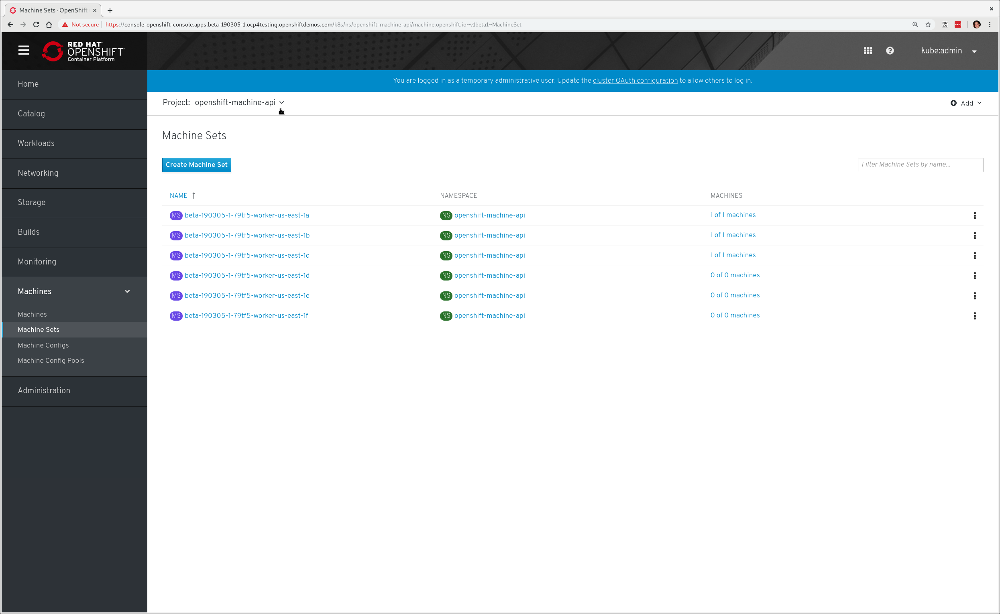</center>

1. Select one of the machine sets in the list by clicking on the name, e.g.
"**beta-190305-1-79tf5-worker-us-east-1a**" (yours will be slightly different)

1. Select a worker set to scale by clicking it.

   > **NOTE**: Depending on the AWS region you chose, you may have several worker machine
   sets that can be scaled, some of which are at a scale of 0. It does not
   matter which set you choose for this example.

1. In the `Actions` pull down menu (on the right hand side), select `Edit Count`

1. Enter '3' and click `Save`

  <center></center>

1. At this point you can click the `Machines` tab in this `Machine Set` display
and see the allocated machines. The `Overview` tab will let you know when the
machines become ready. If you click `Machine Sets` under `Machines` on the
left-hand side again, you will also see the status of the machines in the set:

  <center></center>

1. You may need to wait a few minutes before the machines become ready. If you click `Machine Sets` under `Machines` again, you will also see the status of the machines in the set.

It will take several minutes for the new machines to become ready. In the
background additional EC2 instances are being provisioned and then registered
and configured to participate in the cluster, so yours may still show 1/3.

You can also view this in the CLI:

~~~bash
$ oc get machinesets -n openshift-machine-api
NAME                                    DESIRED   CURRENT   READY     AVAILABLE   AGE
beta-190305-1-79tf5-worker-us-east-1a   3         3         3         3           23h
beta-190305-1-79tf5-worker-us-east-1b   1         1         1         1           23h
beta-190305-1-79tf5-worker-us-east-1c   1         1         1         1           23h
beta-190305-1-79tf5-worker-us-east-1d   0         0                               23h
beta-190305-1-79tf5-worker-us-east-1e   0         0                               23h
beta-190305-1-79tf5-worker-us-east-1f   0         0                               23h

$ oc get nodes
NAME                           STATUS    ROLES     AGE       VERSION
ip-10-0-132-138.ec2.internal   Ready     worker    2m6s      v1.12.4+5dc94f3fda
ip-10-0-137-104.ec2.internal   Ready     worker    23h       v1.12.4+5dc94f3fda
ip-10-0-140-138.ec2.internal   Ready     master    24h       v1.12.4+5dc94f3fda
ip-10-0-140-67.ec2.internal    Ready     worker    2m6s      v1.12.4+5dc94f3fda
ip-10-0-158-222.ec2.internal   Ready     master    24h       v1.12.4+5dc94f3fda
ip-10-0-159-179.ec2.internal   Ready     worker    23h       v1.12.4+5dc94f3fda
ip-10-0-168-43.ec2.internal    Ready     master    24h       v1.12.4+5dc94f3fda
ip-10-0-171-135.ec2.internal   Ready     worker    23h       v1.12.4+5dc94f3fda
~~~

You'll note that some of these systems 'age' will be much newer than some of the
others, these are the ones that will have just been added in. Before continuing,
scale back down by editing the count to whatever it was previously for the
`Machine Set`, i.e. return it to '1' node.

### Note
The default installation currently creates two routers, but they are on the
same host. This is a known bug. It is possible that when you scale down your
cluster that you may inadvertently end up removing the node where the router
was running, which will temporarily make the console and other resources
unavailable. If you suddenly lose access to the web console, wait a few
moments, and then check to see the status of the router pod with:

~~~bash
$ oc get pod -n openshift-ingress
NAME                            READY     STATUS    RESTARTS   AGE
router-default-dffd8548-6g4hz   1/1       Running   0          23h
router-default-dffd8548-vxtt8   1/1       Running   0          23h
~~~

If there is no router pod, or if it is in the `ContainerCreating` state, wait
a little longer.

## Modifying via the CLI

You can alter the `Machine Set` count in several ways in the web UI console,
but you can also perform the same operation via the CLI by using the `oc edit`
command on the `machineset` in the `openshift-machine-api` project-

~~~bash
$ oc edit machineset -n openshift-machine-api
(opens in vi)
~~~

You will see the following text:

~~~bash
# Please edit the object below. Lines beginning with a '#' will be ignored,
# and an empty file will abort the edit. If an error occurs while saving this file will be
# reopened with the relevant failures.
apiVersion: v1
items:
- apiVersion: machine.openshift.io/v1beta1
  kind: MachineSet
  metadata:
    creationTimestamp: 2019-03-05T16:38:39Z
    generation: 3
    labels:
      machine.openshift.io/cluster-api-cluster: beta-190305-1-79tf5
      machine.openshift.io/cluster-api-machine-role: worker
      machine.openshift.io/cluster-api-machine-type: worker
    name: beta-190305-1-79tf5-worker-us-east-1a
    namespace: openshift-machine-api
    resourceVersion: "909452"
    selfLink: /apis/machine.openshift.io/v1beta1/namespaces/openshift-machine-api/machinesets/beta-190305-1-79tf5-worker-us-east-1a
    uid: 21236e24-3f65-11e9-b848-12efc11fb292
  spec:
    replicas: 1                                                                <---------------
    selector:
      matchLabels:
        machine.openshift.io/cluster-api-cluster: beta-190305-1-79tf5
        machine.openshift.io/cluster-api-machineset: beta-190305-1-79tf5-worker-us-east-1a
    template:
(...)
~~~

> **NOTE**: If you're uncomfortable with vi(m) you can use your favourite editor
by specifying `EDITOR=<your choice>` before the `oc` command.

The above is just an excerpt of the entire machine set configuration - each
machine set is listed in this file, but you'll need to change just one of the
sets. In the above output you'll see an line with an arrow to signify where you
can update the count - you'll need to change the `replica: 1` to the count of
your choice. For this example I'd recommend that you set it to '2'. To save your
changes simply save and quit from your editor. OpenShift will now **patch** the
configuration. You should see that your modified machine set (depending on which
one you edited) will be confirmed:

~~~bash
machineset.machine.openshift.io/beta-190305-1-79tf5-worker-us-east-1a edited
machineset.machine.openshift.io/beta-190305-1-79tf5-worker-us-east-1b skipped
machineset.machine.openshift.io/beta-190305-1-79tf5-worker-us-east-1c skipped
machineset.machine.openshift.io/beta-190305-1-79tf5-worker-us-east-1d skipped
machineset.machine.openshift.io/beta-190305-1-79tf5-worker-us-east-1e skipped
machineset.machine.openshift.io/beta-190305-1-79tf5-worker-us-east-1f skipped
~~~

Once that has been changed, you can view the outcome here:

~~~bash
$ oc get machinesets -n openshift-machine-api
NAME                                    DESIRED   CURRENT   READY     AVAILABLE   AGE
beta-190305-1-79tf5-worker-us-east-1a   2         2         2         2           23h
beta-190305-1-79tf5-worker-us-east-1b   1         1         1         1           23h
beta-190305-1-79tf5-worker-us-east-1c   1         1         1         1           23h
beta-190305-1-79tf5-worker-us-east-1d   0         0                               23h
beta-190305-1-79tf5-worker-us-east-1e   0         0                               23h
beta-190305-1-79tf5-worker-us-east-1f   0         0                               23h
~~~

Again, before you move forward, return this count back to how it was before,
using the same method as above.

## Automatic Cluster Scale Up

OpenShift can automatically scale the infrastructure based on workload provided
there is a configuration specified to do so.  Before we begin, ensure that your
cluster is back to having three nodes running:

~~~bash
$ oc get machinesets -n openshift-machine-api
NAME                                    DESIRED   CURRENT   READY     AVAILABLE   AGE
beta-190305-1-79tf5-worker-us-east-1a   1         1         1         1           24h
beta-190305-1-79tf5-worker-us-east-1b   1         1         1         1           24h
beta-190305-1-79tf5-worker-us-east-1c   1         1         1         1           24h
beta-190305-1-79tf5-worker-us-east-1d   0         0                               24h
beta-190305-1-79tf5-worker-us-east-1e   0         0                               24h
beta-190305-1-79tf5-worker-us-east-1f   0         0                               24h
~~~

### Define a `MachineAutoScaler`

Next, configure a `MachineAutoScaler` - you'll need to fetch the following YAML
file:

~~~bash
$ wget https://raw.githubusercontent.com/openshift/training/master/assets/machine-autoscale-example.yaml
~~~

The file has the following contents:

```YAML
kind: List
metadata: {}
apiVersion: v1
items:
- apiVersion: "autoscaling.openshift.io/v1alpha1"
  kind: "MachineAutoscaler"
  metadata:
    generateName: autoscale-<aws-region-az>-
    namespace: "openshift-machine-api"
  spec:
    minReplicas: 1
    maxReplicas: 4
    scaleTargetRef:
      apiVersion: machine.openshift.io/v1beta1
      kind: MachineSet
      name: <clusterid>-worker-<aws-region-az>
- apiVersion: "autoscaling.openshift.io/v1alpha1"
  kind: "MachineAutoscaler"
  metadata:
    generateName: autoscale-<aws-region-az>-
    namespace: "openshift-machine-api"
  spec:
    minReplicas: 1
    maxReplicas: 4
    scaleTargetRef:
      apiVersion: machine.openshift.io/v1beta1
      kind: MachineSet
      name: <clusterid>-worker-<aws-region-az>
- apiVersion: "autoscaling.openshift.io/v1alpha1"
  kind: "MachineAutoscaler"
  metadata:
    generateName: autoscale-<aws-region-az>-
    namespace: "openshift-machine-api"
  spec:
    minReplicas: 1
    maxReplicas: 4
    scaleTargetRef:
      apiVersion: machine.openshift.io/v1beta1
      kind: MachineSet
      name: <clusterid>-worker-<aws-region-az>
```

When you looked at the `MachineSets` with the CLI, you noticed that they all
had the format of:

    <clusterid>-worker-<aws-region-az>

`MachineAutoscaler` resources must be defined for each region-AZ that you want
to autoscale. Using the example output and `MachineSets` above, and selecting
"**us-east-1a**" as the region we're going to autoscale into, you would need
to modify the YAML file to look like the following:

```YAML
...
apiVersion: "autoscaling.openshift.io/v1alpha1"
kind: "MachineAutoscaler"
metadata:
  generateName: autoscale-us-east-1a-
  namespace: "openshift-machine-api"
spec:
  minReplicas: 1
  maxReplicas: 4
  scaleTargetRef:
    apiVersion: machine.openshift.io/v1beta1
    kind: MachineSet
    name: beta-190305-1-79tf5-worker-us-east-1a
...
```

To ensure you make no mistakes:

~~~bash
$ export CLUSTER_NAME=$(oc get machinesets -n openshift-machine-api | awk -F'-worker-' 'NR>1{print $1;exit;}')
$ export REGION_NAME=us-east-1a

$ sed -i s/\<aws-region-az\>/$REGION_NAME/g machine-autoscale-example.yaml
$ sed -i s/\<clusterid\>/$CLUSTER_NAME/g machine-autoscale-example.yaml
~~~

> **NOTE**: If you aren't deployed into this region, or don't want to use
us-east-1a, adapt the instructions to suit.

**Make sure** that you properly modify both `generateName` and `name`. Note
which one has the `<clusterid>` and which one does not. Note that
`generateName` has a trailing hyphen. You can specify the minimum and maximum
quantity of nodes that are allowed to be created by adjusting the
`minReplicas` and `maxReplicas`.

You do not have to define a `MachineAutoScaler` for each `MachineSet`. But
remember that each `MachineSet` corresponds to an AWS region/AZ. So, without
having multiple `MachineAutoScalers`, you could end up with a cluster fully
scaled out in a single AZ. If that's what you're after, it's fine. However if
AWS has a problem in that AZ, you run the risk of losing a large portion of
your cluster.

> **NOTE**: You should probably choose a small-ish number for `maxReplicas`. The
next lab will autoscale the cluster up to that maximum. You're paying for the
EC2 instances.**

Once the file has been modified appropriately, you can now create the
autoscaler:

~~~bash
$ oc create -f machine-autoscale-example.yaml -n openshift-machine-api
machineautoscaler.autoscaling.openshift.io/autoscale-us-east-1a-t6m9k created
machineautoscaler.autoscaling.openshift.io/autoscale-us-east-1a-vr59k created
machineautoscaler.autoscaling.openshift.io/autoscale-us-east-1a-zkt5t created
~~~

### Define a `ClusterAutoscaler`

Next we need to define a `ClusterAutoscaler`, this configures some boundaries
and behaviors for how the cluster will autoscale. An example definition file
can be found at:

https://raw.githubusercontent.com/openshift/training/master/assets/cluster-autoscaler.yaml

This definition is set for a maximum of 20 workers, but we need to reduce that with our labs. Remember, **we are paying for the EC2 instances**. Let's first download that file:

~~~bash
$ wget https://raw.githubusercontent.com/openshift/training/master/assets/cluster-autoscaler.yaml
(...)
~~~

Now modify the max number of replicas:

~~~bash
$ sed -i s/20/10/g cluster-autoscaler.yaml
~~~

Next, we can simply `create` the `ClusterAutoscaler` with the following command:

~~~bash
$ oc create -f cluster-autoscaler.yaml
clusterautoscaler.autoscaling.openshift.io/default created
~~~

> **NOTE:** The `ClusterAutoscaler` is not a namespaced resource -- it exists at
the cluster scope.

### Define a `Job`

The following example YAML file defines a `Job`:

https://raw.githubusercontent.com/openshift/training/master/assets/job-work-queue.yaml

It will produce a massive load that the cluster cannot handle, and will force
the autoscaler to take action (up to the `maxReplicas` defined in your
ClusterAutoscaler YAML).

> **NOTE**: If you did not scale down your machines earlier, you may have too
much capacity to trigger an autoscaling event. Make sure you have no more than
3 total workers before continuing.

Create a project to hold the resources for the `Job`, and switch into it:

~~~bash
$ oc adm new-project autoscale-example && oc project autoscale-example
Created project autoscale-example
Now using project "autoscale-example" on server "https://api.beta-190305-1.ocp4testing.openshiftdemos.com:6443".
~~~

### Open Grafana
In the OpenShift web console, click `Monitoring` and then click `Dashboards`.
This will open a new browser tab for Grafana. You will also get a certificate
error similar to the first time you logged in. This is because Grafana has
its own SSL certificate. You will then see a login button. Grafana is
configured to use an OpenShift user and inherits permissions of that user for
accessing cluster information. This happens to be the user you're already
logged into the web console with.

Finally, allow the permissions, and then you will see the Grafana homepage.

Click the dropdown on `Home` and choose `Kubernetes / Compute Resources /
Cluster`. Leave this browser window open while you start the `Job` so that
you can observe the CPU utilization of the cluster rise:

  <center></center>

### Force an Autoscaling Event

Now we're ready to create the `Job`:

~~~bash
$ oc create -n autoscale-example -f https://raw.githubusercontent.com/openshift/training/master/assets/job-work-queue.yaml
job.batch/work-queue-qncs2 created
~~~

You will see a note that the `Job` was created. It will create a *lot* of `Pods`:

~~~bash
$ oc get pod -n autoscale-example
NAME                     READY     STATUS    RESTARTS   AGE
work-queue-qncs2-26x9c   0/1       Pending   0          33s
work-queue-qncs2-28h6r   0/1       Pending   0          33s
work-queue-qncs2-2tdz9   0/1       Pending   0          33s
work-queue-qncs2-526hl   0/1       Pending   0          33s
work-queue-qncs2-55nr7   0/1       Pending   0          33s
work-queue-qncs2-5d98k   0/1       Pending   0          33s
work-queue-qncs2-7pd5p   0/1       Pending   0          31s
work-queue-qncs2-8k76z   0/1       Pending   0          32s
(...)
~~~

After a few moments, look at the list of `Machines`:

~~~bash
$ oc get machines -n openshift-machine-api
NAME                                          INSTANCE              STATE     TYPE        REGION      ZONE         AGE
beta-190305-1-79tf5-master-0                  i-080dea906d9750737   running   m4.xlarge   us-east-1   us-east-1a   26h
beta-190305-1-79tf5-master-1                  i-0bf5ad242be0e2ea1   running   m4.xlarge   us-east-1   us-east-1b   26h
beta-190305-1-79tf5-master-2                  i-00f13148743c13144   running   m4.xlarge   us-east-1   us-east-1c   26h
beta-190305-1-79tf5-worker-us-east-1a-8dvwq   i-06ea8662cf76c7591   running   m4.large    us-east-1   us-east-1a   2m7s  <--------
beta-190305-1-79tf5-worker-us-east-1a-9pzvg   i-0bf01b89256e7f39f   running   m4.large    us-east-1   us-east-1a   2m7s  <--------
beta-190305-1-79tf5-worker-us-east-1a-vvddp   i-0e649089d42751521   running   m4.large    us-east-1   us-east-1a   2m7s  <--------
beta-190305-1-79tf5-worker-us-east-1a-xx282   i-07b2111dff3c7bbdb   running   m4.large    us-east-1   us-east-1a   26h
beta-190305-1-79tf5-worker-us-east-1b-hjv9c   i-0562517168aadffe7   running   m4.large    us-east-1   us-east-1b   26h
beta-190305-1-79tf5-worker-us-east-1c-cdhth   i-09fbcd1c536f2a218   running   m4.large    us-east-1   us-east-1c   26h
~~~

You should see a scaled-up cluster with three new additions as worker nodes in
us-east-1a, you can see the ones that have been auto-scaled from their age.

Depending on when you run the command, your list may show all running
workers, or some pending. After the `Job` completes, which could take anywhere
from a few minutes to ten or more (depending on your `ClusterAutoscaler` size
and your `MachineAutoScaler` sizes), the cluster should scale down to the
original count of worker nodes. You can watch the output with the following
(runs every 10s)-

~~~bash
$ watch -n10 'oc get machines -n openshift-machine-api'
Every 10.0s: oc get machines -n openshift-machine-api

NAME                                          INSTANCE              STATE     TYPE        REGION      ZONE         AGE
beta-190305-1-79tf5-master-0                  i-080dea906d9750737   running   m4.xlarge   us-east-1   us-east-1a   26h
beta-190305-1-79tf5-master-1                  i-0bf5ad242be0e2ea1   running   m4.xlarge   us-east-1   us-east-1b   26h
beta-190305-1-79tf5-master-2                  i-00f13148743c13144   running   m4.xlarge   us-east-1   us-east-1c   26h
beta-190305-1-79tf5-worker-us-east-1a-8dvwq   i-06ea8662cf76c7591   running   m4.large    us-east-1   us-east-1a   10m
beta-190305-1-79tf5-worker-us-east-1a-9pzvg   i-0bf01b89256e7f39f   running   m4.large    us-east-1   us-east-1a   10m
beta-190305-1-79tf5-worker-us-east-1a-vvddp   i-0e649089d42751521   running   m4.large    us-east-1   us-east-1a   10m
beta-190305-1-79tf5-worker-us-east-1a-xx282   i-07b2111dff3c7bbdb   running   m4.large    us-east-1   us-east-1a   26h
beta-190305-1-79tf5-worker-us-east-1b-hjv9c   i-0562517168aadffe7   running   m4.large    us-east-1   us-east-1b   26h
beta-190305-1-79tf5-worker-us-east-1c-cdhth   i-09fbcd1c536f2a218   running   m4.large    us-east-1   us-east-1c   26h

(Ctrl-C to end)
~~~

In Grafana, be sure to click the `autoscale-example` project in the graphs,
otherwise the interesting things happening might get drowned out by the rest
of the baseline.

# OpenShift Infrastructure Nodes

In this section we're going to look at the OpenShift infrastructure nodes, and more specifically how to scale them once they've been deployed. To understand what we mean by "infrastructure node", the nodes running the following services would fall into that description, although this is not necessarily an exhaustive list:

* Kubernetes and OpenShift control plane services ("masters")
* Router(s)
* Container Image Registry
* Cluster metrics collection ("monitoring")
* Cluster aggregated logging
* Service Brokers

> **NOTE**: The OpenShift subscription model allows customers to run various core
infrastructure components at no additional charge. In other words, a node
that is only running core OpenShift infrastructure components is not counted
in terms of the total number of subscriptions required to cover the
environment. Any node running a container, pod, or component not described above
is considered a worker and must be covered by a subscription.

If we wanted to see what different types of nodes we have in our cluster we need to do a bit of digging. We can list all of the machines as part of our cluster in a couple of different ways, firstly with the simple `oc get nodes` which queries Kubernetes specifically for the nodes that are reporting in:

~~~bash
$ oc project default
$ oc get nodes --show-labels
NAME                                              STATUS    ROLES     AGE       VERSION              LABELS
ip-10-0-129-153.ap-southeast-1.compute.internal   Ready     master    12h       v1.12.4+4dd65df23d   beta.kubernetes.io/arch=amd64,beta.kubernetes.io/instance-type=m4.xlarge,beta.kubernetes.io/os=linux,failure-domain.beta.kubernetes.io/region=ap-southeast-1,failure-domain.beta.kubernetes.io/zone=ap-southeast-1a,kubernetes.io/hostname=ip-10-0-129-153,node-role.kubernetes.io/master=
ip-10-0-135-227.ap-southeast-1.compute.internal   Ready     worker    12h       v1.12.4+4dd65df23d   beta.kubernetes.io/arch=amd64,beta.kubernetes.io/instance-type=m4.large,beta.kubernetes.io/os=linux,failure-domain.beta.kubernetes.io/region=ap-southeast-1,failure-domain.beta.kubernetes.io/zone=ap-southeast-1a,kubernetes.io/hostname=ip-10-0-135-227,node-role.kubernetes.io/worker=
ip-10-0-148-44.ap-southeast-1.compute.internal    Ready     worker    12h       v1.12.4+4dd65df23d   beta.kubernetes.io/arch=amd64,beta.kubernetes.io/instance-type=m4.large,beta.kubernetes.io/os=linux,failure-domain.beta.kubernetes.io/region=ap-southeast-1,failure-domain.beta.kubernetes.io/zone=ap-southeast-1b,kubernetes.io/hostname=ip-10-0-148-44,node-role.kubernetes.io/worker=
ip-10-0-157-229.ap-southeast-1.compute.internal   Ready     master    12h       v1.12.4+4dd65df23d   beta.kubernetes.io/arch=amd64,beta.kubernetes.io/instance-type=m4.xlarge,beta.kubernetes.io/os=linux,failure-domain.beta.kubernetes.io/region=ap-southeast-1,failure-domain.beta.kubernetes.io/zone=ap-southeast-1b,kubernetes.io/hostname=ip-10-0-157-229,node-role.kubernetes.io/master=
ip-10-0-164-113.ap-southeast-1.compute.internal   Ready     master    12h       v1.12.4+4dd65df23d   beta.kubernetes.io/arch=amd64,beta.kubernetes.io/instance-type=m4.xlarge,beta.kubernetes.io/os=linux,failure-domain.beta.kubernetes.io/region=ap-southeast-1,failure-domain.beta.kubernetes.io/zone=ap-southeast-1c,kubernetes.io/hostname=ip-10-0-164-113,node-role.kubernetes.io/master=
ip-10-0-168-95.ap-southeast-1.compute.internal    Ready     worker    12h       v1.12.4+4dd65df23d   beta.kubernetes.io/arch=amd64,beta.kubernetes.io/instance-type=m4.large,beta.kubernetes.io/os=linux,failure-domain.beta.kubernetes.io/region=ap-southeast-1,failure-domain.beta.kubernetes.io/zone=ap-southeast-1c,kubernetes.io/hostname=ip-10-0-168-95,node-role.kubernetes.io/worker=
~~~

And also asking via the `Machine` extension which uses a Kubernetes operator to manage the nodes themselves through the cluster itself; this can give us a little more information about the nodes and the underlying infrastructure, noting that this environment is running on-top of AWS:

~~~bash
oc get machines --all-namespaces --show-labels
NAMESPACE               NAME                                              INSTANCE              STATE     TYPE        REGION           ZONE              AGE       LABELS
openshift-machine-api   cluster-8145-5nvqd-master-0                       i-0e1fe3f94d986c3aa   running   m4.xlarge   ap-southeast-1   ap-southeast-1a   12h       machine.openshift.io/cluster-api-cluster=cluster-8145-5nvqd,machine.openshift.io/cluster-api-machine-role=master,machine.openshift.io/cluster-api-machine-type=master
openshift-machine-api   cluster-8145-5nvqd-master-1                       i-04f521b255b75f1ad   running   m4.xlarge   ap-southeast-1   ap-southeast-1b   12h       machine.openshift.io/cluster-api-cluster=cluster-8145-5nvqd,machine.openshift.io/cluster-api-machine-role=master,machine.openshift.io/cluster-api-machine-type=master
openshift-machine-api   cluster-8145-5nvqd-master-2                       i-05a8f9a53803647bd   running   m4.xlarge   ap-southeast-1   ap-southeast-1c   12h       machine.openshift.io/cluster-api-cluster=cluster-8145-5nvqd,machine.openshift.io/cluster-api-machine-role=master,machine.openshift.io/cluster-api-machine-type=master
openshift-machine-api   cluster-8145-5nvqd-worker-ap-southeast-1a-s9xjj   i-0c77428c3366349ea   running   m4.large    ap-southeast-1   ap-southeast-1a   12h       machine.openshift.io/cluster-api-cluster=cluster-8145-5nvqd,machine.openshift.io/cluster-api-machine-role=worker,machine.openshift.io/cluster-api-machine-type=worker,machine.openshift.io/cluster-api-machineset=cluster-8145-5nvqd-worker-ap-southeast-1a
openshift-machine-api   cluster-8145-5nvqd-worker-ap-southeast-1b-2hmrd   i-05332b2cf3998783e   running   m4.large    ap-southeast-1   ap-southeast-1b   12h       machine.openshift.io/cluster-api-cluster=cluster-8145-5nvqd,machine.openshift.io/cluster-api-machine-role=worker,machine.openshift.io/cluster-api-machine-type=worker,machine.openshift.io/cluster-api-machineset=cluster-8145-5nvqd-worker-ap-southeast-1b
openshift-machine-api   cluster-8145-5nvqd-worker-ap-southeast-1c-s9tr5   i-0380527907d3a5a82   running   m4.large    ap-southeast-1   ap-southeast-1c   12h       machine.openshift.io/cluster-api-cluster=cluster-8145-5nvqd,machine.openshift.io/cluster-api-machine-role=worker,machine.openshift.io/cluster-api-machine-type=worker,machine.openshift.io/cluster-api-machineset=cluster-8145-5nvqd-worker-ap-southeast-1c
~~~

In both of these outputs you'll note that both of the outputs have roles listed, and these are associated to **kubernetes labels** for scheduling purposes; we have two types of role defined, **master**, and **worker**. With the exception of **master** nodes (due to specific scheduling and deployment limitations), all other node types are deployed as part of a `MachineSet`, and can therefore be scaled as one.

## More MachineSet Details
In [the previous section](04-scaling-cluster.md) you explored the
`MachineSets` resource and scaled the cluster by changing its replica count, adding additional workers, we also configured an auto scaler to ensure that the cluster would have the required capacity to accommodate the workload demand. You'll note that right now we only have **worker** type machine sets configured: 

~~~bash
$ oc get machinesets -n openshift-machine-api
NAME                                        DESIRED   CURRENT   READY     AVAILABLE   AGE
cluster-8145-5nvqd-worker-ap-southeast-1a   1         1         1         1           12h
cluster-8145-5nvqd-worker-ap-southeast-1b   1         1         1         1           12h
cluster-8145-5nvqd-worker-ap-southeast-1c   1         1         1         1           12h
~~~

Here we have three distinct machine sets deployed, each with a **single** machine running. Each machine set is aligned with a given AWS EC2 availability zone, and we could easily deploy additional machines (or nodes) into one of the three listed (`1a`, `1b` and `1c`). 
If we wanted to add additional capacity to our cluster we could adjust the replica count like we did in the previous lab, remembering that we randomly selected one of the machine sets in the overall configuration, but that's just for worker nodes, i.e. where our user applications run, and where **some** of the key infrastructure components run by default, e.g. our routers, etc.

If we wanted to create a dedicated infrastructure role where we could run specific infrastructure services, components, and pods on (and move them away from the **worker** nodes like they are by default), we would need to create an additional set of nodes, define a `MachineSet` to deploy and scale them into, and then label them with specific **kubernetes labels**. We can then configure the various components to run specifically on nodes with those labels.

To accomplish this, you will create additional `MachineSets`. The easiest way
to do this is to `get` the existing `MachineSets` by downloading it into a file, and then
modifying them. This is because the `MachineSet` has some details that are
specific to the AWS region that the cluster is deployed in, like the AWS EC2
AMI ID, so crafting it by hand would be very difficult.

Let's take a look at one of our `MachineSets` in detail to understand how the configuration is set, and how we can look to adapt it to create a new one for specifically for our infrastructure services. Use the following command, noting that you'll have to adjust the command to suit the name of your machine set:

~~~bash
$ oc get machineset cluster-8145-5nvqd-worker-ap-southeast-1a -n openshift-machine-api -o yaml
~~~

Which will give you the following output:

```YAML
apiVersion: machine.openshift.io/v1beta1
kind: MachineSet
metadata:
  creationTimestamp: 2019-03-18T00:55:29Z
  generation: 1
  labels:
    machine.openshift.io/cluster-api-cluster: cluster-8145-5nvqd
    machine.openshift.io/cluster-api-machine-role: worker
    machine.openshift.io/cluster-api-machine-type: worker
  name: cluster-8145-5nvqd-worker-ap-southeast-1a
  namespace: openshift-machine-api
  resourceVersion: "16167"
  selfLink: /apis/machine.openshift.io/v1beta1/namespaces/openshift-machine-api/machinesets/cluster-8145-5nvqd-worker-ap-southeast-1a
  uid: 8677e204-4918-11e9-85ca-02fb9875b46a
spec:
  replicas: 1
(...)
```

There are a few very important sections in the output, we'll discuss them in depth below...

### Metadata
The `metadata` on the `MachineSet` itself includes information like the name
of the `MachineSet` and various labels:

```YAML
metadata:
  creationTimestamp: 2019-03-18T00:55:29Z
  generation: 1
  labels:
    machine.openshift.io/cluster-api-cluster: cluster-8145-5nvqd
    machine.openshift.io/cluster-api-machine-role: worker
    machine.openshift.io/cluster-api-machine-type: worker
  name: cluster-8145-5nvqd-worker-ap-southeast-1a
  namespace: openshift-machine-api
  resourceVersion: "16167"
  selfLink: /apis/machine.openshift.io/v1beta1/namespaces/openshift-machine-api/machinesets/cluster-8145-5nvqd-worker-ap-southeast-1a
  uid: 8677e204-4918-11e9-85ca-02fb9875b46a
```

> **NOTE**: You might see some `annotations` on your `MachineSet` if you use the `MachineSet` that you defined a `MachineAutoScaler` on in the previous lab section.

### Selector
The `MachineSet` defines how to create `Machines`, and the `Selector` tells
the operator which machines are associated with the set, note that `replicas: 1` is set here, hence we only have one machine in this set running:

```YAML
spec:
  replicas: 1
  selector:
    matchLabels:
      machine.openshift.io/cluster-api-cluster: cluster-8145-5nvqd
      machine.openshift.io/cluster-api-machineset: cluster-8145-5nvqd-worker-ap-southeast-1a
```

In this case, the cluster name is `8145-5nvqd` and there is an additional
label for the whole set.

### Template Metadata
The `template` section is the part of the `MachineSet` that specifically templates out the
`Machine`. The `template` itself can have metadata associated, and we need to make sure that things match here when we make changes:

```YAML
  template:
    metadata:
      creationTimestamp: null
      labels:
        machine.openshift.io/cluster-api-cluster: cluster-8145-5nvqd
        machine.openshift.io/cluster-api-machine-role: worker
        machine.openshift.io/cluster-api-machine-type: worker
        machine.openshift.io/cluster-api-machineset: cluster-8145-5nvqd-worker-ap-southeast-1a
```

### Template Spec
The `template` needs to `spec`ify how the `Machine`/node should be created, i.e. "use this configuration for all machines in this set"; this configuration will be used when provisioning new systems when scaling is required. You will notice that the `spec` and, more specifically, the `providerSpec` contains all of the important AWS data to help get the `Machine` created
correctly and bootstrapped.

In our case, we want to ensure that the resulting node inherits one or more
specific labels. As you've seen in the examples above, labels go in
`metadata` sections:

```YAML
    spec:
      metadata:
        creationTimestamp: null
      providerSpec:
        value:
          ami:
            id: ami-08b086f355b2ad409
          apiVersion: awsproviderconfig.openshift.io/v1beta1
          blockDevices:
          - ebs:
              iops: 0
              volumeSize: 120
              volumeType: gp2
          deviceIndex: 0
          iamInstanceProfile:
            id: cluster-8145-5nvqd-worker-profile
          instanceType: m4.large
          kind: AWSMachineProviderConfig
          metadata:
            creationTimestamp: null
          placement:
            availabilityZone: ap-southeast-1a
            region: ap-southeast-1
          publicIp: null
          securityGroups:
          - filters:
            - name: tag:Name
              values:
              - cluster-8145-5nvqd-worker-sg
          subnet:
            filters:
            - name: tag:Name
              values:
              - cluster-8145-5nvqd-private-ap-southeast-1a
```
By default the `MachineSets` that the installer creates do not apply any
additional labels to the node.

> **NOTE**: As you can probably see, there's plenty of AWS-specific provider configuration here, in future versions of OpenShift, there will be similar respective parameters for other infrastructure providers that can be used.

## Defining a Custom MachineSet
In this section we're going to be defining a custom `MachineSet` for infrastructure services. Now that you've inspected an existing `MachineSet` it's time to go over the
rules for creating one, at least for a simple change like we're making:

1. Don't change anything in the `providerSpec`
1. Don't change any instances of `sigs.k8s.io/cluster-api-cluster: <clusterid>`
1. Give your `MachineSet` a unique `name`
1. Make sure any instances of `sigs.k8s.io/cluster-api-machineset` match the `name`
1. Add labels you want on the nodes to `.spec.template.spec.metadata.labels`
1. Even though you're changing `MachineSet` `name` references, be sure not to change the `subnet`.

This sounds complicated, so let's go through an example. Go ahead and dump
one of your existing `MachineSets` to a file, remembering to adjust this command to match one of yours:

~~~bash
$ oc get machineset cluster-8145-5nvqd-worker-ap-southeast-1a -o yaml -n openshift-machine-api > infra-machineset.yaml
(No output)
~~~

Now open it with a text editor of your choice:

~~~bash
$ vi infra-machineset.yaml
~~~

Let's now take some steps to adapt this `MachineSet` to suit our required new **infrastructure** node type...

### Clean It
Since we asked OpenShift to tell us about an _existing_ `MachineSet`, there's a
lot of extra data that we can immediately remove from the file. Remove the following:

1. Within the `.metadata` top level, remove:

	* `generation`
	* `resourceVersion`
	* `selfLink`
	* `uid`

2. The entire `.status` block.

3. All instances of `creationTimestamp`.

### Name It
Go ahead and change the top-level `.metadata.name` to something indicative of
the purpose of this set, for example:

    name: infrastructure-ap-southeast-1a

By looking at this `MachineSet` we can tell that it houses
infrastructure-focused `Machines` (nodes) in `ap-southeast-1` region in the `a`
availability zone. Ultimately, you can call this anything you like, but we should change this to something that makes sense for your cluster.

### Match It
Change any instance of `sigs.k8s.io/cluster-api-machineset` to match your new
name of `infrastructure-ap-southeast-1a` (or whatever you're using). This appears in both
`.spec.selector.matchLabels` as well as `.spec.template.metadata.labels`.

### Add Your Node Label
Add a `labels` section to `.spec.template.spec.metadata` with the label
`node-role.kubernetes.io/infra: ""`. Why this particular label?
Because `oc get node` looks at the `node-role.kubernetes.io/xxx` label and
shows that in the output. This will make it easy to identify which workers
are also infrastructure nodes (the quotes are because of the boolean). 

Your resulting section should look somewhat like the following, albeit with slightly different names as per your unique cluster name:

```YAML
spec:
  replicas: 1
  selector:
    matchLabels:
      machine.openshift.io/cluster-api-cluster: cluster-8145-5nvqd
      machine.openshift.io/cluster-api-machineset: infrastructure-ap-southeast-1a
  template:
    metadata:
      labels:
        machine.openshift.io/cluster-api-cluster: cluster-8145-5nvqd
        machine.openshift.io/cluster-api-machine-role: worker
        machine.openshift.io/cluster-api-machine-type: worker
        machine.openshift.io/cluster-api-machineset: infrastructure-ap-southeast-1a
    spec:
      metadata:
        labels:
          node-role.kubernetes.io/infra: ""
```

### Set the replica count
For now, make the replica count 1, which it should be already, unless you didn't change it from a previous lab instruction:

```YAML
spec:
  replicas: 1
```

### Change the Instance Type
If you want a different EC2 instance type, you can change that. It is one of
the few things in the `providerSpec` block you can realistically change. You
can also change volumes if you want a different storage size or need
additional volumes on your instances.

Save your file and exit.

### Double Check
Your cluster will have a different ID and you are likely operating in a
different version, however, your file should more or less look like the
following:

```YAML
apiVersion: machine.openshift.io/v1beta1
kind: MachineSet
metadata:
  labels:
    machine.openshift.io/cluster-api-cluster: cluster-8145-5nvqd
    machine.openshift.io/cluster-api-machine-role: worker
    machine.openshift.io/cluster-api-machine-type: worker
  name: infrastructure-ap-southeast-1a
  namespace: openshift-machine-api
spec:
  replicas: 1
  selector:
    matchLabels:
      machine.openshift.io/cluster-api-cluster: cluster-8145-5nvqd
      machine.openshift.io/cluster-api-machineset: infrastructure-ap-southeast-1a
  template:
    metadata:
      labels:
        machine.openshift.io/cluster-api-cluster: cluster-8145-5nvqd
        machine.openshift.io/cluster-api-machine-role: worker
        machine.openshift.io/cluster-api-machine-type: worker
        machine.openshift.io/cluster-api-machineset: infrastructure-ap-southeast-1a
    spec:
      metadata:
        labels:
          node-role.kubernetes.io/infra: ""
      providerSpec:
        value:
          ami:
            id: ami-08b086f355b2ad409
          apiVersion: awsproviderconfig.openshift.io/v1beta1
          blockDevices:
          - ebs:
              iops: 0
              volumeSize: 120
              volumeType: gp2
          deviceIndex: 0
          iamInstanceProfile:
            id: cluster-8145-5nvqd-worker-profile
          instanceType: m4.large
          kind: AWSMachineProviderConfig
          metadata:
          placement:
            availabilityZone: ap-southeast-1a
            region: ap-southeast-1
          publicIp: null
          securityGroups:
          - filters:
            - name: tag:Name
              values:
              - cluster-8145-5nvqd-worker-sg
          subnet:
            filters:
            - name: tag:Name
              values:
              - cluster-8145-5nvqd-private-ap-southeast-1a
          tags:
          - name: kubernetes.io/cluster/cluster-8145-5nvqd
            value: owned
          - name: Stack
            value: project ocp4-coreos-deployer-8145
          - name: owner
            value: noreply@opentlc.com
          userDataSecret:
            name: worker-user-data
      versions:
        kubelet: ""
```

## Create Your Machineset
Now you can create your `MachineSet` from the definition that we created:

```bash
$ oc create -f infra-machineset.yaml -n openshift-machine-api
machineset.machine.openshift.io/infrastructure-ap-southeast-1a created
```

Then go ahead and check to see if this new `MachineSet` is listed:

```bash
$ oc get machineset -n openshift-machine-api
NAME                                        DESIRED   CURRENT   READY     AVAILABLE   AGE
cluster-8145-5nvqd-worker-ap-southeast-1a   1         1         1         1           15h
cluster-8145-5nvqd-worker-ap-southeast-1b   1         1         1         1           15h
cluster-8145-5nvqd-worker-ap-southeast-1c   1         1         1         1           15h
infrastructure-ap-southeast-1a              1         1                               46s
```

We don't yet have any ready or available machines in the set because the
instance is still coming up and bootstrapping. We can check every minute or to see see whether the machine has been created or not, noting that in the output below the new node is now running:

~~~bash
$ oc get machine -n openshift-machine-api
NAME                                              INSTANCE              STATE     TYPE        REGION           ZONE              AGE
cluster-8145-5nvqd-master-0                       i-0e1fe3f94d986c3aa   running   m4.xlarge   ap-southeast-1   ap-southeast-1a   15h
cluster-8145-5nvqd-master-1                       i-04f521b255b75f1ad   running   m4.xlarge   ap-southeast-1   ap-southeast-1b   15h
cluster-8145-5nvqd-master-2                       i-05a8f9a53803647bd   running   m4.xlarge   ap-southeast-1   ap-southeast-1c   15h
cluster-8145-5nvqd-worker-ap-southeast-1a-s9xjj   i-0c77428c3366349ea   running   m4.large    ap-southeast-1   ap-southeast-1a   15h
cluster-8145-5nvqd-worker-ap-southeast-1b-2hmrd   i-05332b2cf3998783e   running   m4.large    ap-southeast-1   ap-southeast-1b   15h
cluster-8145-5nvqd-worker-ap-southeast-1c-s9tr5   i-0380527907d3a5a82   running   m4.large    ap-southeast-1   ap-southeast-1c   15h
infrastructure-ap-southeast-1a-wkj4c              i-069189c06f38ee9a3   running   m4.large    ap-southeast-1   ap-southeast-1a   114s
~~~

Now we can use `oc get nodes` to see when the actual node is joined and
ready. If you're having trouble figuring out which node is the new one, take
a look at the `AGE` column. It will be the youngest! Again, this node may show up as a `Machine` in the previous API call, but may not have joined the cluster yet, so give it some time to bootstrap properly.

~~~bash
$ oc get nodes
NAME                                              STATUS    ROLES          AGE       VERSION
ip-10-0-129-153.ap-southeast-1.compute.internal   Ready     master         15h       v1.12.4+4dd65df23d
ip-10-0-131-124.ap-southeast-1.compute.internal   Ready     infra,worker   6m7s      v1.12.4+4dd65df23d
ip-10-0-135-227.ap-southeast-1.compute.internal   Ready     worker         15h       v1.12.4+4dd65df23d
ip-10-0-148-44.ap-southeast-1.compute.internal    Ready     worker         15h       v1.12.4+4dd65df23d
ip-10-0-157-229.ap-southeast-1.compute.internal   Ready     master         15h       v1.12.4+4dd65df23d
ip-10-0-164-113.ap-southeast-1.compute.internal   Ready     master         15h       v1.12.4+4dd65df23d
ip-10-0-168-95.ap-southeast-1.compute.internal    Ready     worker         15h       v1.12.4+4dd65df23d
~~~

## Check the Labels
In our case, the youngest node was named
`ip-10-0-131-124.ap-southeast-1.compute.internal`, so we can ask what its labels
are:

~~~bash
$ oc get node ip-10-0-131-124.ap-southeast-1.compute.internal --show-labels
NAME                                              STATUS    ROLES          AGE       VERSION              LABELS
ip-10-0-131-124.ap-southeast-1.compute.internal   Ready     infra,worker   7m5s      v1.12.4+4dd65df23d   beta.kubernetes.io/arch=amd64,beta.kubernetes.io/instance-type=m4.large,beta.kubernetes.io/os=linux,failure-domain.beta.kubernetes.io/region=ap-southeast-1,failure-domain.beta.kubernetes.io/zone=ap-southeast-1a,kubernetes.io/hostname=ip-10-0-131-124,node-role.kubernetes.io/infra=,node-role.kubernetes.io/worker=
~~~

It's hard to see, but our `node-role.kubernetes.io/infra` label is the `LABELS` column. You
will also see `infra,worker` in the output of `oc get node` in the `ROLES`
column. Success!

## Add More Machinesets (or scale, or both)
In a realistic production deployment, you would want at least 3 `MachineSets`
to hold infrastructure components. Both the logging aggregation solution and
the service mesh will deploy ElasticSearch, and ElasticSearch really needs 3
instances spread across 3 discrete nodes. Why 3 `MachineSets`? Well, in
theory, having a `MachineSet` in different AZs ensures that you don't go
completely dark if AWS loses an AZ.

For the purposes of this exercise, though, we'll just scale up our single
set:

~~~bash
$ oc edit machineset infrastructure-ap-southeast-1a -n openshift-machine-api
(Opens in vi)
~~~

> **NOTE**: If you're uncomfortable with vi(m) you can use your favourite editor
by specifying `EDITOR=<your choice>` before the `oc` command.

Change the `.spec.replicas` from 1 to 3, and then save/exit the editor.

~~~bash
machineset.machine.openshift.io/infrastructure-ap-southeast-1a edited
~~~

You can issue `oc get machineset` to see the change in the desired number of
instances, and then `oc get machine` and `oc get node` as before. Just don't
forget the `-n openshift-machine-api` or be sure to switch to that namespace
with `oc project openshift-machine-api`.

# Moving Infrastructure Components
Now that we have provisioned some infrastructure specific nodes, it's time to move various
infrastructure components onto them, i.e. move them away from the worker nodes, and onto the fresh systems. Let's go through some of them individually to see how they can be moved, and how to monitor the progress.

> **NOTE**: The following assumes that you used at least version `0.14.1` of the installer. Which would result in a minimum `clusterversion` of `4.0.0-0.7`.

## Router
The OpenShift router is deployed, maintained, and scaled by an `Operator` called
`openshift-ingress-operator`. Its `Pod` lives in the
`openshift-ingress-operator` project:

```bash
$ oc get pod -n openshift-ingress-operator
NAME                                READY     STATUS    RESTARTS   AGE
ingress-operator-7d74fdfc5f-zhngh   1/1       Running   0          15h
```

The actual default router instance lives in the `openshift-ingress` project:

```bash
$ oc get pod -n openshift-ingress -o wide
NAME                              READY     STATUS    RESTARTS   AGE       IP           NODE                                              NOMINATED NODE
router-default-5fc6c9ffbb-9x9l8   1/1       Running   0          15h       10.131.0.7   ip-10-0-135-227.ap-southeast-1.compute.internal   <none>
router-default-5fc6c9ffbb-p5x6d   1/1       Running   0          15h       10.131.0.8   ip-10-0-135-227.ap-southeast-1.compute.internal   <none>
```

The cluster deploys two routers for availability and fault tolerance, and you can see that the pods are deployed across two nodes. Right now, these will be deployed on nodes with the `worker` label, and not on the `infrastructure` nodes that were recently deployed, as the default configuration of the router operator is to pick nodes with the role of `worker`.

Pick one of the nodes (from `NODE`) where a router pod is running and see the `ROLES` column:

~~~bash
$ oc get node ip-10-0-135-227.ap-southeast-1.compute.internal
NAME                                              STATUS    ROLES     AGE       VERSION
ip-10-0-135-227.ap-southeast-1.compute.internal   Ready     worker    15h       v1.12.4+4dd65df23d
~~~

ut, now that we have created dedicated infrastructure nodes, we want to tell the operator to put the router instances on nodes with the new role of `infra`.

The OpenShift router operator creates a custom resource definition (`CRD`)
called `clusteringress`. The `clusteringress` objects are observed by the router operator and tell the operator how to create and configure routers. Let's take a look:

~~~bash
$ oc get clusteringress default -n openshift-ingress-operator -o yaml
~~~

Which will give you the following output:

```YAML
apiVersion: ingress.openshift.io/v1alpha1
kind: ClusterIngress
metadata:
  creationTimestamp: 2019-03-18T00:59:59Z
  finalizers:
  - ingress.openshift.io/default-cluster-ingress
  generation: 1
  name: default
  namespace: openshift-ingress-operator
  resourceVersion: "17987"
  selfLink: /apis/ingress.openshift.io/v1alpha1/namespaces/openshift-ingress-operator/clusteringresses/default
  uid: 2763923f-4919-11e9-85ca-02fb9875b46a
spec:
  defaultCertificateSecret: null
  highAvailability: null
  ingressDomain: null
  namespaceSelector: null
  nodePlacement:
    nodeSelector:
      matchLabels:
        node-role.kubernetes.io/worker: ""
  replicas: 2
  routeSelector: null
  unsupportedExtensions: null
status:
  highAvailability:
    type: Cloud
  ingressDomain: apps.cluster-8145.8145.sandbox389.opentlc.com
  labelSelector: app=router,router=router-default
  replicas: 2
```

As you can see, the `nodeSelector` is configured for the `worker` role. Go
ahead and use `oc edit` to change `node-role.kubernetes.io/worker` to be
`node-role.kubernetes.io/infra`:

```bash
$ oc edit clusteringress default -n openshift-ingress-operator -o yaml
(Opens in vi)
```

The relevant section should look like the following:

~~~YAML
spec:
  defaultCertificateSecret: null
  highAvailability: null
  ingressDomain: null
  namespaceSelector: null
  nodePlacement:
    nodeSelector:
      matchLabels:
        node-role.kubernetes.io/infra: ""
~~~

After saving and exiting the editor, if you're quick enough, you might catch
the router pod being moved to its new home. Run the following command and you may see something like:

```bash
$ oc get pod -n openshift-ingress -o wide
NAME                              READY     STATUS        RESTARTS   AGE       IP           NODE                                              NOMINATED NODE
router-default-5fc6c9ffbb-9x9l8   1/1       Running       0          15h       10.131.0.7   ip-10-0-131-124.ap-southeast-1.compute.internal   <none>
router-default-5fc6c9ffbb-p5x6d   0/1       Terminating   0          15h       10.131.0.8   ip-10-0-135-227.ap-southeast-1.compute.internal   <none>
```

In the above output, the `Terminating` pod was running on one of the worker nodes. The `Running` pod is now on one of our nodes with the `infra` role.

**NOTE**: The actual moving of the pod is currently not working (you can track the
progress [here](https://jira.coreos.com/browse/NE-72)), so as a temporary workaround we can force the router pods to be rebuilt on other nodes by running:

~~~bash
$ for i in $(oc get pod -n openshift-ingress | awk 'NR>1{print $1;}'); do oc delete pod $i -n openshift-ingress; done
pod "router-default-5fc6c9ffbb-9x9l8" deleted
pod "router-default-5fc6c9ffbb-p5x6d" deleted
~~~

> **WARNING**: If you're using the browser-based terminal, your session will hang when the router pods get removed, as we're reliant on the routers to serve your console. The session may restore itself after a minute or two, or you can try reloading the page.

If we wait a minute or so, we should see that the pods are rebuilt:

~~~bash
$ oc get pod -n openshift-ingress -o wide
NAME                              READY     STATUS    RESTARTS   AGE       IP           NODE                                              NOMINATED NODE
router-default-5fc6c9ffbb-2jtrx   1/1       Running   0          70s       10.131.2.5   ip-10-0-142-239.ap-southeast-1.compute.internal   <none>
router-default-5fc6c9ffbb-jplph   1/1       Running   0          83s       10.128.4.6   ip-10-0-133-204.ap-southeast-1.compute.internal   <none>
~~~

If we check one of the nodes for the `ROLE` that it's labeled with:

~~~bash
$ oc get node ip-10-0-142-239.ap-southeast-1.compute.internal
NAME                                              STATUS    ROLES          AGE       VERSION
ip-10-0-142-239.ap-southeast-1.compute.internal   Ready     infra,worker   19m       v1.12.4+4dd65df23d
~~~

Success! Our pods have been automatically redeployed onto the infrastructure nodes.

## Container Image Registry
The registry uses a similar `CRD` (Custom Resource Definition) mechanism to configure how the operator deploys the actual registry pods. That CRD is
`configs.imageregistry.operator.openshift.io`. You will need to edit the `cluster` CR
object in order to add the `nodeSelector`. First, take a look at it:

~~~bash
$ oc get configs.imageregistry.operator.openshift.io/cluster -o yaml
~~~

Which will give you the following output:

```YAML
apiVersion: imageregistry.operator.openshift.io/v1
kind: Config
metadata:
  creationTimestamp: 2019-02-27T14:08:32Z
  finalizers:
  - imageregistry.operator.openshift.io/finalizer
  generation: 1
  name: cluster
  resourceVersion: "106372"
  selfLink: /apis/imageregistry.operator.openshift.io/v1/configs/cluster
  uid: 2a5609e5-3a99-11e9-bf3b-02319b2b6c5a
spec:
  httpSecret: ec7df887545c5e6a5dadf049a6c7a3e9102ecb92b57876fde1f658303038e192479a251a9f2f80d968c3a59a749526e724c632e2f0b85a83de9d2c3bbe04339a
  logging: 2
  managementState: Managed
  proxy: {}
  replicas: 1
  requests:
    read: {}
    write: {}
  storage:
    s3:
      bucket: image-registry-us-east-1-dac0065618f84094b8e8faf4de2fd3f9-2a66
      encrypt: true
      region: us-east-1
status:
...
```

Next, let's modify the custom resource by live-patching the configuration. For this we can use `oc edit`, and you'll need to modify the `.spec` section:

~~~bash
$ oc edit configs.imageregistry.operator.openshift.io/cluster
~~~

The `.spec` section will need to look like the following:

```YAML
  nodeSelector:
    node-role.kubernetes.io/infra: ""
```

Once you're done, save and exit the editor, and it should confirm the change:

~~~bash
config.imageregistry.operator.openshift.io/cluster edited
~~~

> **NOTE**: The `nodeSelector` stanza may be added **anywhere** inside the `.spec` block.

When you save and exit you should see the registry pod being moved to the
infra node. The registry is in the `openshift-image-registry` project. If you
execute the following quickly enough, you may see the old registry pods terminating and the new ones starting.:

~~~bash
$ oc get pod -n openshift-image-registry
NAME                                               READY     STATUS        RESTARTS   AGE
cluster-image-registry-operator-8548dcf5b8-rlrhg   1/1       Running       0          16h
image-registry-559d48d7fc-zw8fr                    1/1       Terminating   0          16h
node-ca-5wq4z                                      1/1       Running       0          16h
node-ca-622n2                                      1/1       Running       0          16h
node-ca-7x5l4                                      1/1       Running       0          62m
node-ca-956sf                                      1/1       Running       0          28m
node-ca-kwllr                                      1/1       Running       0          16h
node-ca-twz85                                      1/1       Running       0          28m
node-ca-vgkt4                                      1/1       Running       0          16h
node-ca-xjkfd                                      1/1       Running       0          16h
node-ca-xnct7                                      1/1       Running       0          16h
~~~

> **NOTE**: At this time the image registry is not using a separate project for its
operator. Both the operator and the operand are housed in the
`openshift-image-registry` project.

Since the registry is being backed by an S3 bucket, it doesn't matter what
node the new registry pod instance lands on. It's talking to an object store
via an API, so any existing images stored there will remain accessible.

Also note that the default replica count is 1. In a real-world environment
you might wish to scale that up for better availability, network throughput,
or other reasons.

If you look at the node on which the registry landed (noting that you'll likely have to refresh your list of pods by using the previous commands to get its new name):

~~~bash
$ oc get pod image-registry-6dd97df674-v77m2 -n openshift-image-registry -o wide
NAME                              READY     STATUS    RESTARTS   AGE       IP           NODE                                              NOMINATED NODE
image-registry-6dd97df674-v77m2   1/1       Running   0          4m45s     10.130.2.6   ip-10-0-131-124.ap-southeast-1.compute.internal   <none>
~~~

...you'll note that it is now running on an infra worker:

~~~bash
$ oc get node ip-10-0-131-124.ap-southeast-1.compute.internal
NAME                                              STATUS    ROLES          AGE       VERSION
ip-10-0-131-124.ap-southeast-1.compute.internal   Ready     infra,worker   67m       v1.12.4+4dd65df23d
~~~

Lastly, notice that the CRD for the image registry's configuration is not
namespaced -- it is cluster scoped. There is only one internal/integrated
registry per OpenShift cluster that serves all projects.

## Monitoring
The Cluster Monitoring operator is responsible for deploying and managing the
state of the Prometheus+Grafana+AlertManager cluster monitoring stack. It is
installed by default during the initial cluster installation. Its **operator**
uses a `ConfigMap` in the `openshift-monitoring` project to set various
tunables and settings for the behavior of the monitoring stack.

There is no `ConfigMap` created as part of the installation. Without one, the operator will assume default settings, as we can see, this is not defined:

```bash
$ oc get configmap cluster-monitoring-config -n openshift-monitoring
```

Even with the default settings, The operator will create several `ConfigMap` objects for the
various monitoring stack components, and you can see them, too:

```bash
$ oc get configmap -n openshift-monitoring
NAME                                        DATA      AGE
adapter-config                              1         16h
grafana-dashboard-k8s-cluster-rsrc-use      1         16h
grafana-dashboard-k8s-node-rsrc-use         1         16h
grafana-dashboard-k8s-resources-cluster     1         16h
grafana-dashboard-k8s-resources-namespace   1         16h
grafana-dashboard-k8s-resources-pod         1         16h
grafana-dashboards                          1         16h
kubelet-serving-ca-bundle                   1         16h
prometheus-adapter-prometheus-config        1         16h
prometheus-k8s-rulefiles-0                  1         16h
serving-certs-ca-bundle                     1         16h
sharing-config                              3         16h
telemeter-client-serving-certs-ca-bundle    1         16h
```


Take a look at the following file, it contains the definition for a `ConfigMap` that will cause the monitoring solution to be redeployed onto infrastructure nodes:

https://github.com/openshift/training/blob/master/assets/cluster-monitoring-configmap.yaml

Let's use this as our new configuration; you can create the new monitoring config with the following command:

```bash
$ oc create -f https://raw.githubusercontent.com/openshift/training/master/assets/cluster-monitoring-configmap.yaml
configmap/cluster-monitoring-config created
```

We can now watch the various monitoring pods be redeployed onto our `infrastructure` nodes with the following command:

~~~bash
$ oc get pod -w -n openshift-monitoring
NAME                                           READY     STATUS              RESTARTS   AGE
alertmanager-main-0                            3/3       Running             0          16h
alertmanager-main-1                            3/3       Running             0          16h
alertmanager-main-2                            0/3       ContainerCreating   0          3s
cluster-monitoring-operator-6fc8c9bc75-6pfpw   1/1       Running             0          16h
grafana-574679769d-7f9mf                       2/2       Running             0          16h
kube-state-metrics-55f8d66c77-sbbbc            3/3       Running             0          16h
kube-state-metrics-578dbdf85d-85vm7            0/3       ContainerCreating   0          9s
node-exporter-2x7b7                            2/2       Running             0          16h
node-exporter-d4vq9                            2/2       Running             0          45m
node-exporter-dx5kz                            2/2       Running             0          16h
node-exporter-f9g4h                            2/2       Running             0          16h
node-exporter-kvd5x                            2/2       Running             0          45m
node-exporter-ntzbp                            2/2       Running             0          16h
node-exporter-prsj9                            2/2       Running             0          1h
node-exporter-qx9lf                            2/2       Running             0          16h
node-exporter-wh9qs                            2/2       Running             0          16h
prometheus-adapter-7fb8c8b544-jn8q2            1/1       Running             0          32m
prometheus-adapter-7fb8c8b544-v5rfs            1/1       Running             0          33m
prometheus-k8s-0                               6/6       Running             1          16h
prometheus-k8s-1                               6/6       Running             1          16h
prometheus-operator-7787679668-nxc6s           0/1       ContainerCreating   0          8s
prometheus-operator-954644495-m64hd            1/1       Running             0          16h
telemeter-client-79f99d7bc6-4p8zv              3/3       Running             0          16h
telemeter-client-7f48f48dd7-dvblb              0/3       ContainerCreating   0          4s
grafana-5fc5979587-bdkcd                       0/2       Pending             0          3s

(Ctrl+C to exit)
~~~

> **NOTE**: You can also run `watch 'oc get pod -n openshift-monitoring'` as an alternative.

# Extensions to OpenShift using OperatorHub

OpenShift 4 has a slimmer base, with the ability to easily extend it with
Operators for both cluster services (networking, storage, logging) and
applications (databases, message queues, source control) for your developers
to build applications with.

OperatorHub is a feature built into your cluster to discover and install
Operators on your cluster. OperatorHub is only available for cluster
administrators. Once installed, these services are made available to users of
the cluster through the Developer Catalog.

Within OperatorHub, you will find three sets of Operators available to you:

* Red Hat Products - licensed software that is tested extensively on OpenShift 4.
* Certified Partners - partners that have certified their applications for 
  OpenShift and have established a mutual support SLA with Red Hat, in order to 
  provide you with the best experience.
* Community - a set of curated Operators built by the Kubernetes community and 
  work well with the Operator Lifecycle Management software already installed
  on your cluster.

In this example we're going to deploy Couchbase through the Operator framework
in OpenShift 4; Couchbase is a powerful NoSQL database implementation.

## Create a Project
Before you get started, create a project for what you're about to do with
Couchbase. You can either do it from the command line:

~~~bash
$ oc new-project mycouchbase
Now using project "mycouchbase" on server "https://api.cluster-7316.7316.sandbox222.opentlc.com:6443".
~~~

...or from the web console.

## Installing an Extension

Installing your first Operator is best done through the user interface, but
can also be driven by the command line. Let's complete this section using the
web console:

1. Open the OpenShift web console, and log-in.

2. On the left-hand side menu select '**Catalog**', then '**OperatorHub**':

	

	> **NOTE**: Only users with cluster admin privileges can see the Operator
Hub interface.

3. At the top of the page, in the **Project** selector, choose `mycouchbase`.

4. Search, or browse to the Couchbase Operator and select it by clicking on it.

5. The description lays out the notable features of the
Operator. Go ahead and click "Install" to deploy the Operator on to the
cluster. It may take several moments after clicking "Install" before the
Subscription page shows up:

	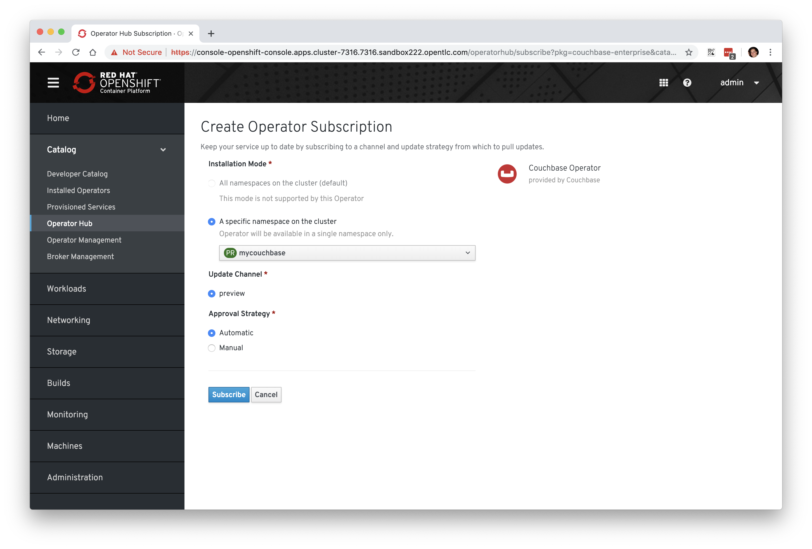

The installation process involves "**subscribing**" to an Operator from the hub.
This subscription mechanism is how OpenShift learns about updates to the
operator. Operator creators may roll updates for their operators to handle
things like updates, enhancements, bug fixes, and other changes to the
solution that the operator deploys. There are a number of options that you need
to be aware of when deploying an Operator:

### Installation Mode

Operators can be enabled for all Projects across the cluster or only within
specific namespaces. Not all Operators support each of these installation
methods. The Couchbase operator only supports installation for a specific
namespace. Make sure `mycouchbase` is selected to match the project you
created earlier.

### Update Channel

Each Operator publisher can create channels for their software, to give
adminsitrators more control over the versions that are installed. In this
case, Couchbase only has a "preview" channel.

### Update Approval Strategy

If Operator creators enable their operators to update the deployed solutions,
Operator Lifecycle Manager is able to automatically apply those updates.
Cluster administrators can decide whether or not OLM should or should not
automatically apply updates. In the future, when Couchbase releases an
updated operator to the "preview" channel, you can decide whether you want to
approve each update, or have it happen automatically. Choose "Automatic" for
now.

After clicking "Subscribe", the Couchbase entry will now show that it is
"Installed":


It's important to note that while the Operator Hub page indicates that the
operator is "installed", really it is indicating that the operator is configured
to be installed. It may take several minutes for OpenShift to pull in the
operator to the cluster. You can check on the status of this operator with the
following command:

~~~bash
$ oc get pod --all-namespaces | grep -i couch
mycouchbase               couchbase-operator-7b4885487c-9wz5t                    1/1       Running     0          8m28s
openshift-marketplace     installed-certified-mycouchbase-654bb64bc5-w8b9g       1/1       Running     0          9m16s
~~~

You will likely see the Couchbase operator pod in `ContainerCreating` status
if you look very soon after finishing the installation/subscription process.

## Removing Limits

As part of the SKO bootstrap process, we set some limits on the amount of resources that our cluster can consume on a per-project basis. Leaving these limits in-place will cause our CouchBase Cluster to fail to initialise. Let's remove this before we proceed any further...

~~~bash
$ oc delete limitranges/mycouchbase-core-resource-limits
limitrange "mycouchbase-core-resource-limits" deleted
~~~

> **NOTE**: Make sure that you run that command before proceeding!

## Using Secrets
The Couchbase operator is capable of installing and managing a Couchbase
cluster for you. But, before it can do that, it has a [prerequisite for a
Kubernetes
secret](https://docs.couchbase.com/operator/1.1/couchbase-cluster-config.html#authsecret)
that it can use to configure the username and password for the cluster. You
have a couple of ways to create this secret.

Firstly can you can do it via the Web Console:

1. Open the OpenShift web console and navigate to "**Workloads**" on the
left-hand side menu and then select "**Secrets"**.

2. Make sure the Project selector is set to `mycouchbase` at the top.

3. Now click the "**Create**" selector and choose "Key/Value Secret":

	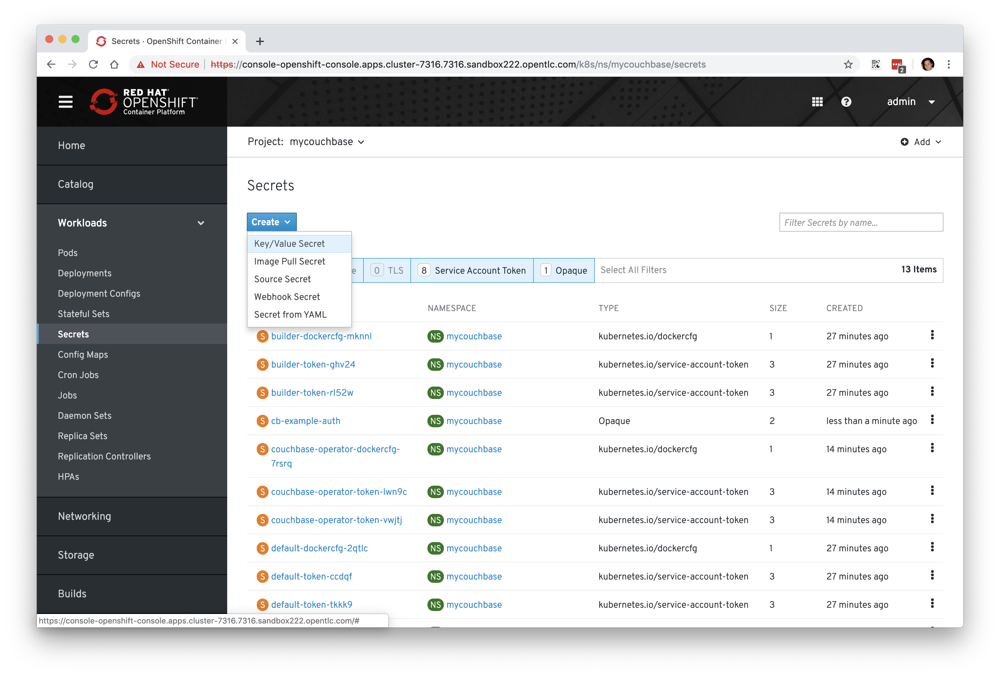

4. Click "**+ Add**" at the upper right-hand area of the panel, and then
choose "**Import YAML**". Paste the following YAML into the form (the username
is "couchbase" and the password is "securepassword"):

    ```YAML
    apiVersion: v1
    data:
      password: c2VjdXJlcGFzc3dvcmQ=
      username: Y291Y2hiYXNl
    kind: Secret
    metadata:
      name: cb-example-auth
      namespace: mycouchbase
    type: Opaque
    ```

5. Once you're done, finally click create:

	

**Alternatively**, you can create the secret directly using the following
command:

~~~bash
$ oc create -f https://raw.githubusercontent.com/openshift/training/master/assets/cb-example-auth.yaml
~~~

Ultimately, you want a secret with the username `couchbase` and the password
`securepassword` (both examples above use that).

## Using an Installed Operator

Regular users will use the "**Developer Catalog**" menu to add shared apps,
services, or source-to-image builders to projects. Let's explore that interface
and deploy a Couchbase cluster from our newly created Operator:

1. Navigate to the "**Developer Catalog**" from the "**Catalog**" section of the
main menu on the left-hand side.

	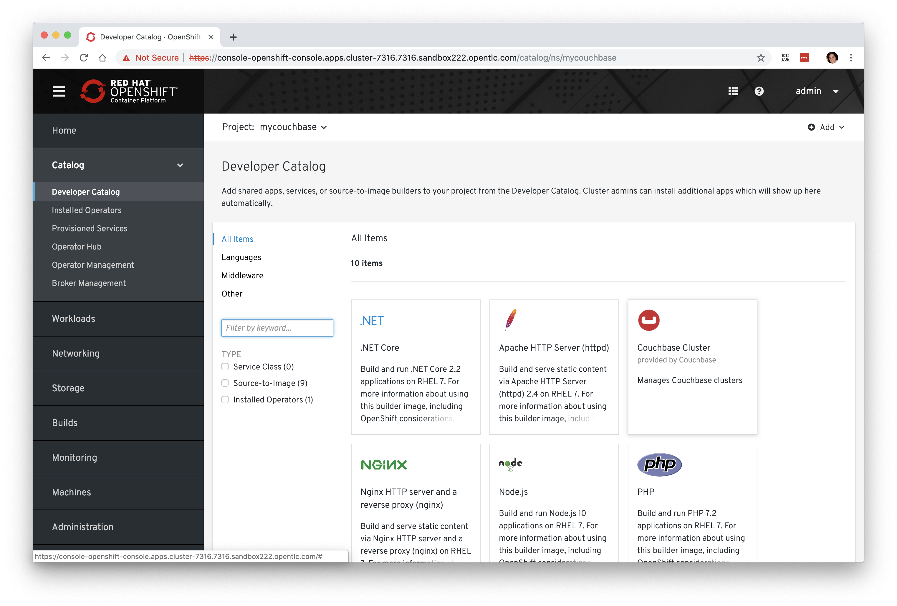

2. At the top of the page, again make sure you select `mycouchbase` from the
Project dropdown.

3. You should see that the Couchbase operator is available. If you choose a
different Project, you should also notice that the Couchbase operator is **not**
available in other Projects.

4. Click on the Couchbase Cluster tile, which is a capability that the Operator
has extended our OpenShift cluster to support. Operators can expose more than
one capability. For example, the MongoDB Operator exposes three common
configurations of its database (and you would see three _different_ MongoDB
tiles).

5. Deploy an instance of Couchbase by clicking the "**Create**" button in the
top left:

	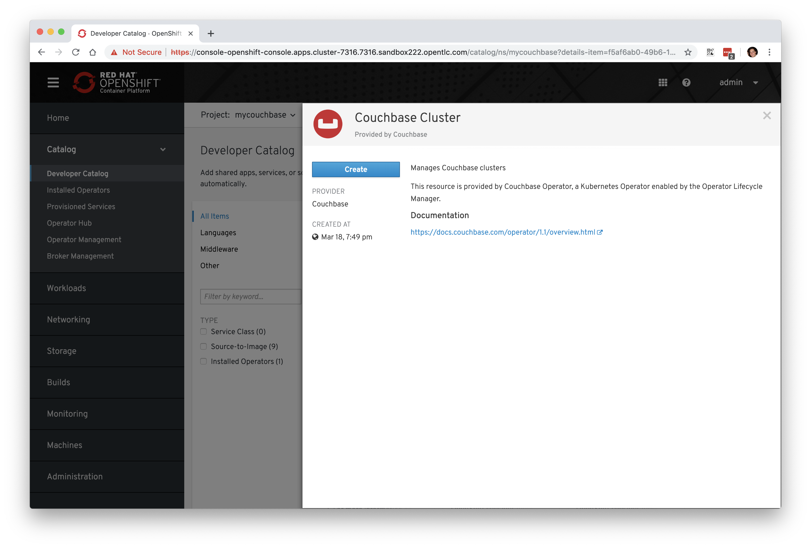

6. The YAML editor has been pre-filled with a set of defaults for the
resulting Couchbase cluster. One of those defaults is a reference to the
Secret you created earlier:

	

7. At this point we're able to change some of the Couchbase deployment
parameters to our liking. Set the `replicas` field (under `.spec.buckets`) to
`3`, so our Operator sets up a highly available cluster for us. Your YAML should
look like the following:

	```YAML
	apiVersion: couchbase.com/v1
	kind: CouchbaseCluster
	metadata:
	  name: cb-example
	  namespace: default
	spec:
	  authSecret: cb-example-auth
	  baseImage: registry.connect.redhat.com/couchbase/server
	  buckets:
	    - conflictResolution: seqno
	      enableFlush: true
	      evictionPolicy: fullEviction
	      ioPriority: high
	      memoryQuota: 128
	      name: default
	      replicas: 3
	      type: couchbase
	  ...
	```

8. Click "**Create**". Afterwards, you will be taken to a list of all Couchbase
instances running with this Project and should see the one you just created
has a status of "**Creating**":

	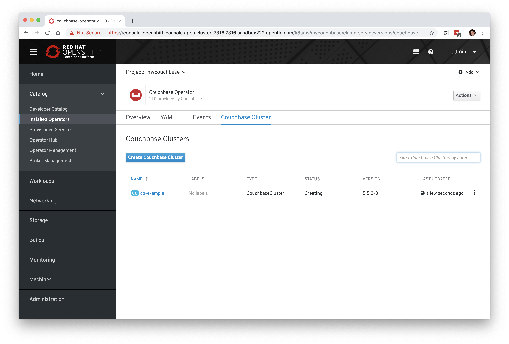

### View the Deployed Resources

Navigate to the Couchbase Cluster that was deployed by clicking `cb-example`,
and then click on the "**Resources**" tab. This collects all of the objects
deployed and managed by the Operator. From here you can ultimately view Pod
logs to check on the Couchbase Cluster instances.

If for some reason you had navigated away from the page after creating your
Couchbase cluster, you can get back here by clicking "**Catalog**" ->
"**Installed Operators**" -> "**Couchbase Cluster**" -> `cb-example`.

We are going to use the Service `cb-example` to access the Couchbase
dashboard via a Route:

~~~bash
$ oc expose service cb-example -n mycouchbase
route.route.openshift.io/cb-example exposed
~~~

You should now have a route:

~~~bash
$ oc get route -n mycouchbase
NAME         HOST/PORT                                                              PATH      SERVICES     PORT        TERMINATION   WILDCARD
cb-example   cb-example-mycouchbase.apps.cluster-7316.7316.sandbox222.opentlc.com             cb-example   couchbase                 None
~~~

Your Couchbase installation is now exposed directly to the internet and is
not using HTTPS. Go ahead and copy/paste the URL into your browser. Login
with the user `couchbase` and the password `securepassword` (these were in
your secret). If you used different credentials, make sure you put in the
right ones:

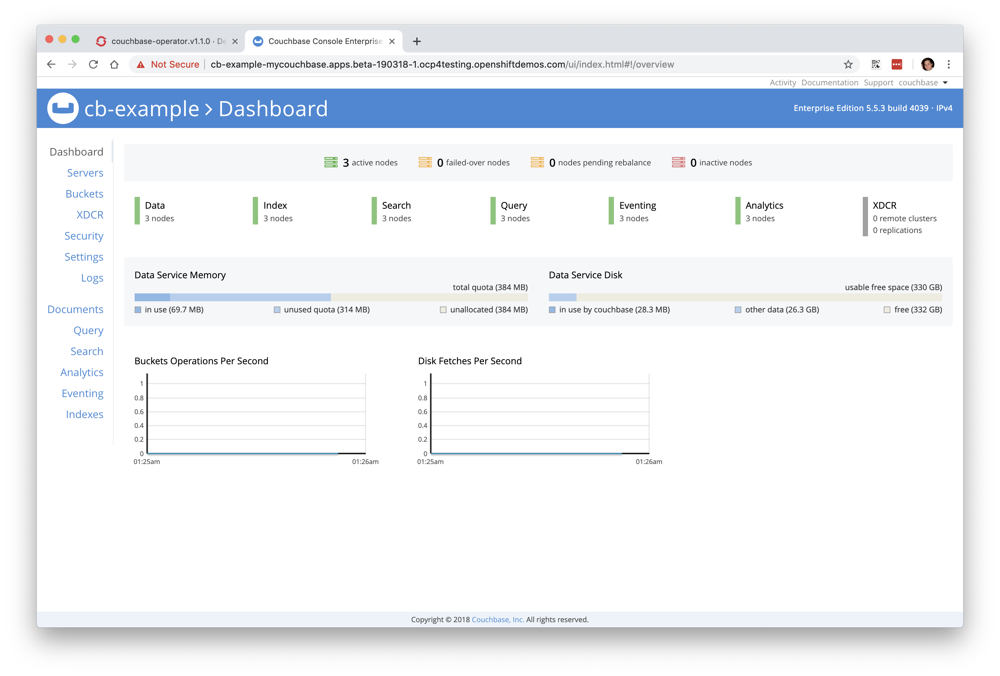

In the above, you should see 3 nodes listed for each function. We'll dynamically
modify this in the next section.

### Re-Configure the Cluster with the Operator

Keep the Couchbase dashboard up, but select the **Servers** link on the
left-hand side, it should look like the following:

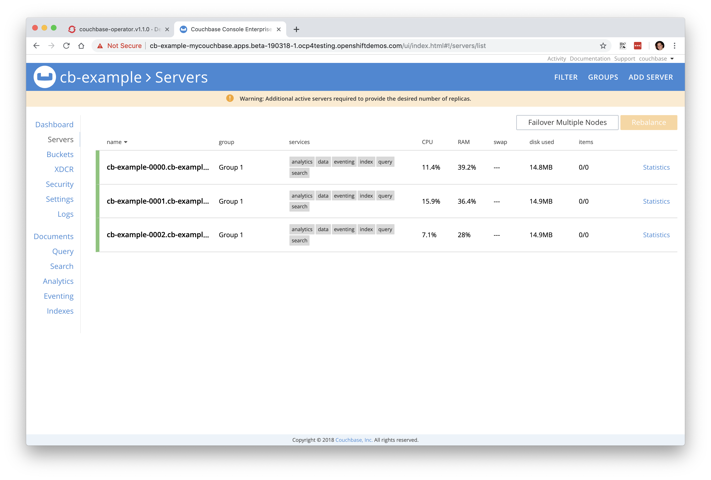

As the Operator scales up more Pods, they will automatically join and appear in
the dashboard. Next, edit your `cb-example` Couchbase instance to have a server
size of `4` instead of `3`. You can navigate back to the installed instances of
Couchbase via the web console, or you can use:

~~~bash
$ oc edit couchbaseclusters.couchbase.com/cb-example -n mycouchbase
(Opens in vi)
~~~

Ensure that your `.spec.servers` section of the yaml looks like the following-

```YAML
  servers:
  - name: all_services
    services:
    - data
    - index
    - query
    - search
    - eventing
    - analytics
    size: 4
```

When you've updated your yaml, save and exit your editor:

~~~bash
couchbasecluster.couchbase.com/cb-example edited
~~~

A few things will happen:

* The Operator will detect the difference between the desired state and the 
  current state
* A new Pod will be created and show up under "Resources"
* The Couchbase dashboard will show 4 instances once the Pod is created
* The Couchbase dashboard will show that the cluster is being rebalanced

Your cluster dashboard should dynamically update to show the progress:


After the cluster is scaled up to `4`, try scaling back down to `3`:

~~~bash
$ oc edit couchbaseclusters.couchbase.com/cb-example -n mycouchbase
(Opens in vi)
~~~

If you watch the dashboard closely, you will see that Couchbase has
automatically triggered a re-balance of the data within the cluster to reflect
the new topology of the cluster. This is one of many advanced feautres embedded
within applications in OperatorHub to save you time when administering your
workloads.

### Delete the Couchbase Instance

After you are done, delete the `cb-example` Couchbase instance and the
Opeator will clean up all of the resources that were deployed. Remember to
delete the Route that we manually created as well. Remember to delete the
Operator instance and not to delete the Pods or other resources directly --
the operator will immediately try to fix that thinking that there's a
problem!

1. Navigate to "**Catalog**" --> "**Installed Operators**" on the left-hand
side

2. Select the "**Couchbase Cluster**" link under `Provided APIs` towards the
right of the panel

3. On the right of the `cb-example` cluster line, click on the drop down (3
dots) and select "**Delete Couchbase Cluster**":

	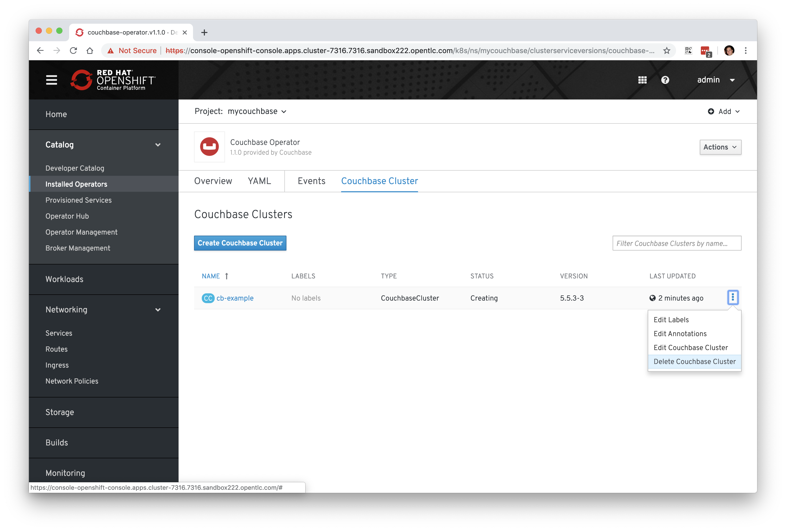

4. Return to the main menu on the left hand side, navigate to "**Networking**"
and then to "**Routes**"

5. On the drop-down menu (3 dots) to the right of our "**cb-example**" route,
select "**Delete Route**":

	

After you delete the `cb-example` cluster, if you look at the pods
quickly you'll see the pods terminating, otherwise you'll likely only see the
Operator pod running:

~~~bash
$ oc get pod -n mycouchbase
NAME                                 READY     STATUS    RESTARTS   AGE
couchbase-operator-678994b98-sqnt2   1/1       Running   0          39m
~~~

The Operator Pod remains, that's because there's still a Subscription for the
Couchbase operator in this Project. You can delete the Subscription (and, thus,
the Pod) by going to "**Operator Management**" -> "**Operator Subscriptions**".
There you can click the 3 dots and remove the Subscription for the Couchbase
Operator in the `mycouchbase` Project. Now there should be no pods, and you can
also delete the project if you wish.

Either way, return to the default project before continuing:

~~~bash
$ oc project default
Now using project "default" on server "https://api.cluster-7316.7316.sandbox222.opentlc.com:6443".
~~~

OpenShift 4 as a Developer
============
In this section we're aiming to get you familiar with Red Hat OpenShift Container Platform 4.0 from a developer perspective, using container-native developer tooling to develop and deploy a sample app with Red Hat Middleware. It's comprised of a number of individual steps inside of this section that will run you through some of the more common tasks:

* Deploying application services to developer projects with OpenShift [Operators](https://blog.openshift.com/introducing-the-operator-framework/) and the Operator Hub. 
* Creating development environments with [CodeReady Workspaces](https://developers.redhat.com/products/codeready-workspaces/overview/)
* Building and deploying a sample app with [`odo`](https://github.com/redhat-developer/odo) and [Red Hat Middleware](https://developers.redhat.com/middleware/)
* A preview of a new middleware framework named [Quarkus](https://quarkus.io), with features like a unified Reactive and Imperative programming model, native image compilation, blazingly fast startup times, and Live Reloading of Java code.

We feel that giving you a hands-on overview of developing apps on OpenShift will be a lot more beneficial than just delivering slideware. We want to make sure that you know how the components fit together, and how to use it. We will use a combination of command-line tools (`oc`, `odo`) and interaction via the OpenShift Web Console and CodeReady Workspaces.


Install Operators
====================
In this lab we will use CodeReady to create and work with a sample app based on [Red Hat Data Grid](https://developers.redhat.com/products/datagrid/overview/). To get access to CodeReady and Data Grid services, you need to point to a special repo containing operator catalog entries. Install this catalog using the following `oc` command, noting that you'll have to copy from cat to EOF, and paste it in. This will create a custom _OperatorSource_ object that will bring in the Operator catalog items needed for this workshop and make it available via OperatorHub:

~~~bash
cat <<EOF | oc create -f -
apiVersion: marketplace.redhat.com/v1alpha1
kind: OperatorSource
metadata:
  name: sko-operators
  namespace: openshift-marketplace
spec:
  type: appregistry
  endpoint: https://quay.io/cnr
  registryNamespace: jamesfalkner
  displayName: "Red Hat SKO 2019"
  publisher: "Red Hat"
EOF
~~~

If it was successful you should see the following:

~~~bash
operatorsource.marketplace.redhat.com/sko-operators created
~~~

Create project
==============
Let's first create a developer project. Use the OpenShift Web Console, navigate to _Home_ > _Projects_, and click _Create Project_ to create a new project named `skodemo`:

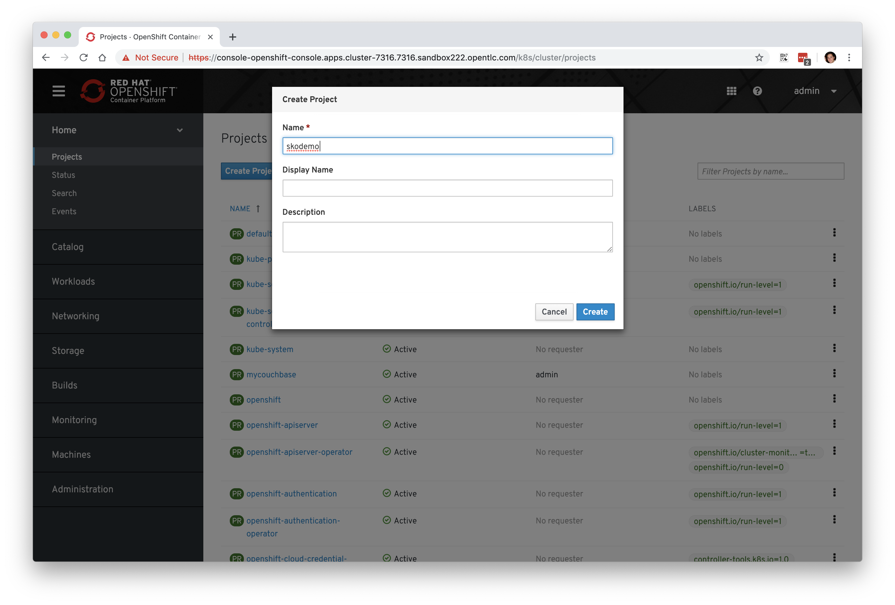

Alternatively, if you're more comfortable with the CLI, you can do it with `oc new-project skodemo`.

Install Red Hat Data Grid
==========================
In our new project we will first deploy Red Hat Data Grid, a high performance, distributed data grid which our sample application will use for its reactive capabilities. Navigate to _Catalog_ > _Operator Hub_ in the OpenShift Console.

Search for `grid` or browse to find **Red Hat Data Grid**, and click on it, and then click **Install**:

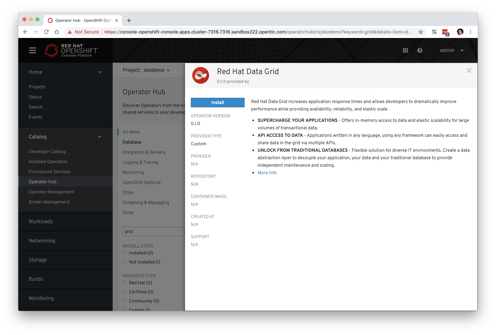

We will install this Operator into our new namespace, so be sure to choose "_A specific Namespace on the cluster_" and choose your new project `skodemo`, and click **Subscribe** to install the operator into the namespace (leave everything else on the default settings):

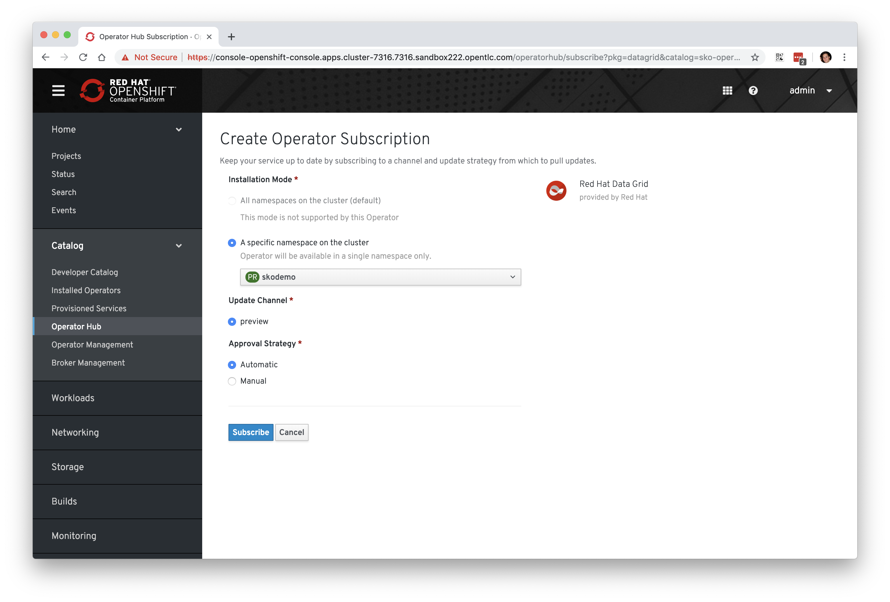

Note that this is not the same as installing Data Grid itself - that's the next step!

Navigate to _Catalog_ > _Installed Operators_, and click on the Red Hat Data Grid operator (if you do not see it yet, it may take a few minutes to appear):

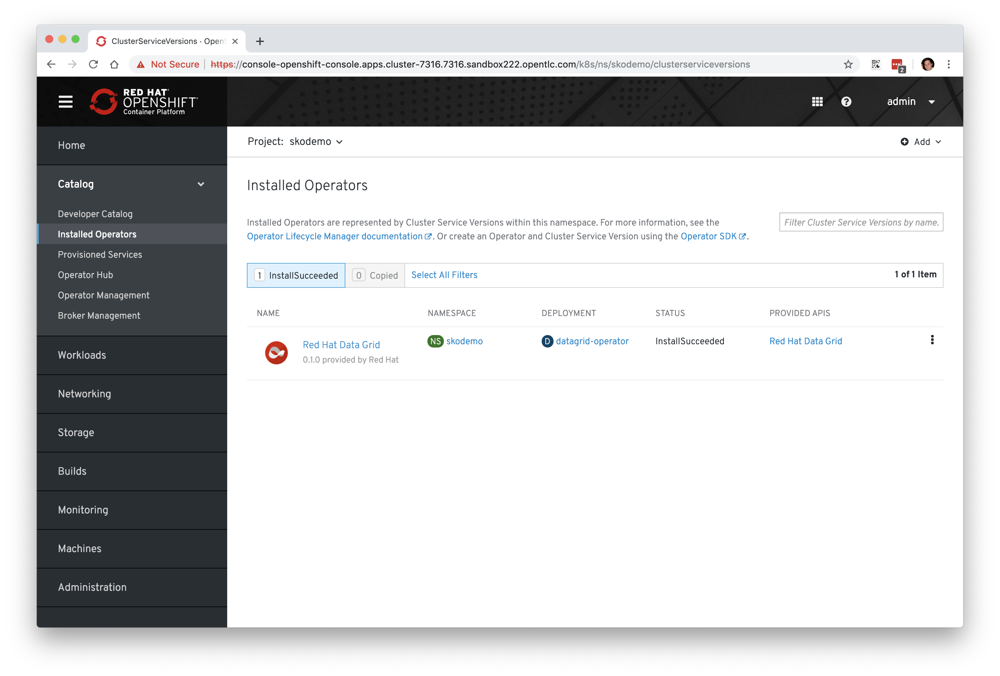

This operator exposes one API, namely Red Hat Data Grid itself, so click on the "**Red Hat Data Grid**" name on the left, and select "__Create New__". Don't change anything in the YAML file defaults, and click __Create__. This will cause Red Hat Data Grid to be deployed to your project's namespace and can now be used by projects. If you navigate to _Workloads_ > _Pods_ you'll be able to see the Data Grid pods spinning up:

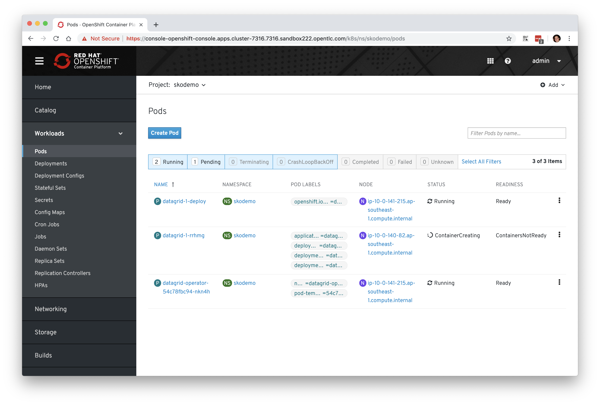

Install CodeReady
=================
CodeReady is Red Hat's browser-based intelligent developer IDE. We'll use the CodeReady operator to deploy CodeReady so that we can use it in our project to develop our apps.

Once again, navigate to _Catalog_ > _Operator Hub_.

Search for `codeready` or browse the catalog to find the _CodeReady Operator_, and click on it, and then click **Install**:

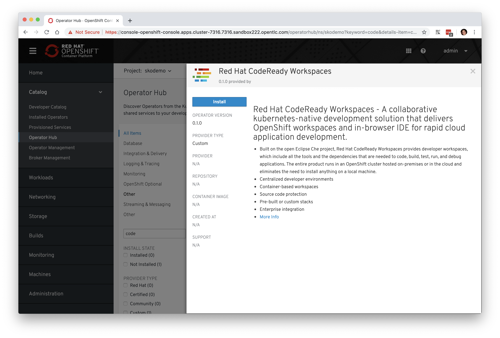

We will install this Operator into our new namespace, just like Data Grid, so be sure to choose "A specific Namespace on the cluster" and choose `skodemo`, and click **Subscribe** to install the operator into the namespace (leave everything else on the default settings):


For this demo, we'll give the Operator administrator privileges so that it can create the needed resources. Run this command before proceeding:

~~~bash
$ oc adm policy add-cluster-role-to-user cluster-admin system:serviceaccount:skodemo:codeready-operator -n skodemo
cluster role "cluster-admin" added: "system:serviceaccount:skodemo:codeready-operator"
~~~

With the Operator installed, navigate to _Catalog_ > _Installed Operators_, and click on the CodeReady operator on the left-hand side. This operator exposes one API, namely CodeReady itself, so click __Create New__ on the CodeReady tile. Don't change anything in the YAML file defaults, and click __Create__. This will cause CodeReady to be deployed to the `codeready` namespace, and usable from your project's namespace.

This will take several minutes to complete, and will install CodeReady into the `codeready` namespace. Once you see all 3 pods in the `Running` state using this command, then you can proceed:

~~~bash
$ oc get pods -n codeready
NAME                         READY     STATUS      RESTARTS   AGE
che-operator                 0/1       Completed   0          22m
codeready-79c69d5bb6-hrg78   1/1       Running     0          17m
keycloak-7556f7965f-6jkk4    1/1       Running     0          21m
postgres-6d69656d56-hzn9t    1/1       Running     0          22m
~~~

Be sure to wait for all of these to be ready and _Running_ before continuing, noting that the operator should show 'Completed' when it's done its job of deployment for us, so don;t worry about that one... 

Install Custom Stack
====================

CodeReady comes with several out-of-the-box _stacks_ for different developer scenarios, but we want to create a custom stack that will give us access to a few custom tools within our workspaces. 

Let's log into CodeReady Workspaces. To figure out the URL for CodeReady, run the following command in your Terminal:

~~~bash
echo http://$(oc get route codeready -n codeready -o jsonpath='{.spec.host}{"\n"}')
http://codeready-codeready.apps.cluster-7316.7316.sandbox222.opentlc.comnu
~~~

Then open the URL in your browser. The first time you access CodeReady, you'll need to click _Register_ and create a new account using this information (it doesn't really matter what you put in reality, as long as you supply a valid-looking email address, username and password):

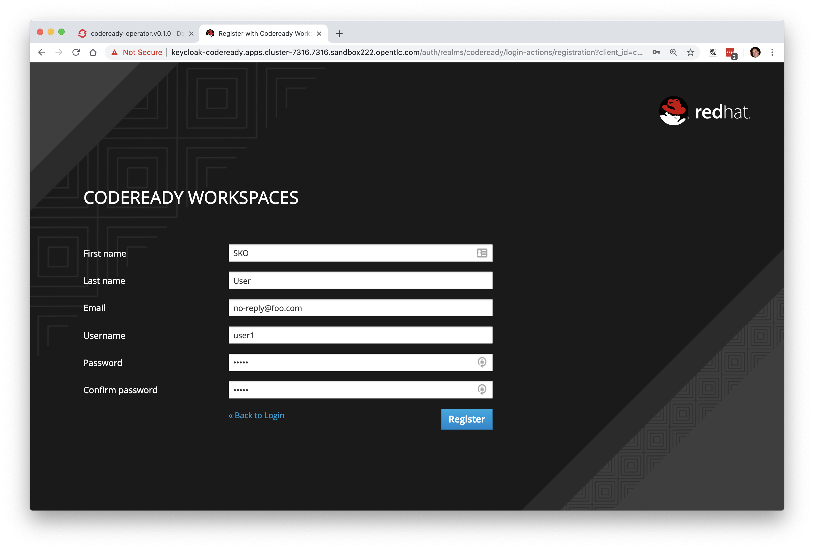

* First Name: `SKO`
* Last Name: `User`
* Email `no-reply@foo.com`
* Username: `user1`
* Password: `user1`

Once logged in, we'll create our custom stack through the CodeReady REST API browser. Open the REST API in a new tab in your browser:

~~~bash
$ echo http://$(oc get route codeready -n codeready -o jsonpath='{.spec.host}{"\n"}')/swagger
http://codeready-codeready.apps.cluster-7316.7316.sandbox222.opentlc.com/swagger
~~~

Expand the `stack` API (by clicking on it), and find the `POST /stack` API. In the `body` field, paste the following content that defines our custom stack:


```json
{
  "name": "SKO 2019 - Java, CodeReady, odo",
  "description": "Java JDK Stack on CentOS",
  "scope": "general",
  "workspaceConfig": {
    "environments": {
      "default": {
        "recipe": {
          "type": "dockerimage",
          "content": "schtool/che-vertx-odo:latest"
        },
        "machines": {
          "dev-machine": {
            "env": {},
            "servers": {
              "8080/tcp": {
                "attributes": {},
                "protocol": "http",
                "port": "8080"
              },
              "8000/tcp": {
                "attributes": {},
                "protocol": "http",
                "port": "8000"
              }
            },
            "volumes": {},
            "installers": [
              "org.eclipse.che.exec",
              "org.eclipse.che.terminal",
              "org.eclipse.che.ws-agent"
            ],
            "attributes": {
              "memoryLimitBytes": "2147483648"
            }
          }
        }
      }
    },
    "commands": [
      {
        "commandLine": "mvn install -f ${current.project.path} -s ${current.project.path}/.settings.xml",
        "name": "build",
        "type": "mvn",
        "attributes": {
          "goal": "Build",
          "previewUrl": ""
        }
      },
      {
        "commandLine": "mvn clean install -f ${current.project.path} -s ${current.project.path}/.settings.xml",
        "name": "clean build",
        "type": "mvn",
        "attributes": {
          "goal": "Build",
          "previewUrl": ""
        }
      },
      {
        "commandLine": "mvn verify -f ${current.project.path} -s ${current.project.path}/.settings.xml",
        "name": "test",
        "type": "mvn",
        "attributes": {
          "goal": "Test",
          "previewUrl": ""
        }
      },
      {
        "commandLine": "mvn clean compile quarkus:dev -f ${current.project.path}",
        "name": "Build and Run Locally",
        "type": "custom",
        "attributes": {
          "goal": "Run",
          "previewUrl": "${server.8080/tcp}"
        }
      }
    ],
    "projects": [],
    "defaultEnv": "default",
    "name": "default",
    "links": []
  },
  "components": [
    {
      "version": "---",
      "name": "CentOS"
    },
    {
      "version": "1.8.0_45",
      "name": "JDK"
    },
    {
      "version": "3.5.0",
      "name": "Maven"
    },
    {
      "version": "2.4",
      "name": "Ansible"
    },
    {
      "version": "4.0.0",
      "name": "OpenShift CLI"
    }
  ],
  "creator": "ide",
  "tags": [
    "Java",
    "JDK",
    "Maven",
    "Ansible",
    "CentOS",
    "Git"
  ],
  "id": "java-centos-sko"
}
```

Click the **Try it out!** button below _Response Messages_ to register the stack. It should report HTTP result code `201` indicating the stack was created. Any other result code means it was not created successfully, so double-check you're doing the `POST /stack` API and that you're logged in:


Create CodeReady Workspace with custom Java stack
============================================
CodeReady has the concept of _Workspaces_ which are team collaboration areas for different projects. Let's create a new Workspace and base it on our new stack we created. Navigate back to the CodeReady homepage; if you don't still have it you can find it at this URL:

~~~bash
$ echo http://$(oc get route codeready -n codeready -o jsonpath='{.spec.host}{"\n"}')
http://codeready-codeready.apps.cluster-7316.7316.sandbox222.opentlc.com
~~~

You should still be logged in as `user1`. It should have already opened up the "**New Workspace**" page, but if it hasn't, click on **Create Workspace**. Locate the new stack in the list of stacks available. If you do not see it, be sure to select the **All** tab to show all available stacks. Look for the one titled **SKO 2019 - Java, CodeReady, odo**. Select it, then click **Create & Open**. This will start the workspace as a container on OpenShift, however there is a bug within CodeReady Workspaces on OCP 4 Beta:

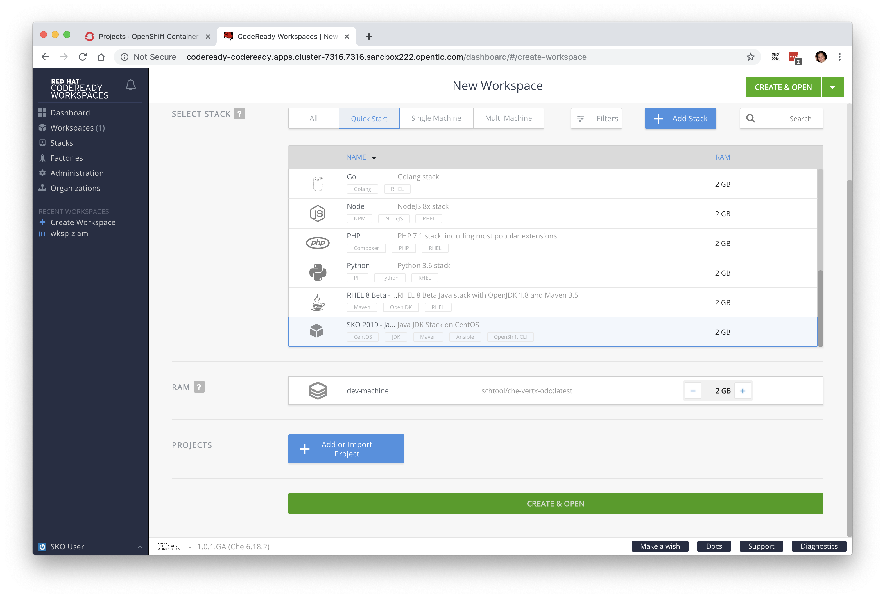

Workaround for bug 
==================
[This bug](https://github.com/eclipse/che/issues/12889) prevents CodeReady Workspaces from starting up the first time on OCP 4. On the CodeReady main page, click on **Workspaces (1)**, and then click the "Stop" button (square shape) next to your new workspace:

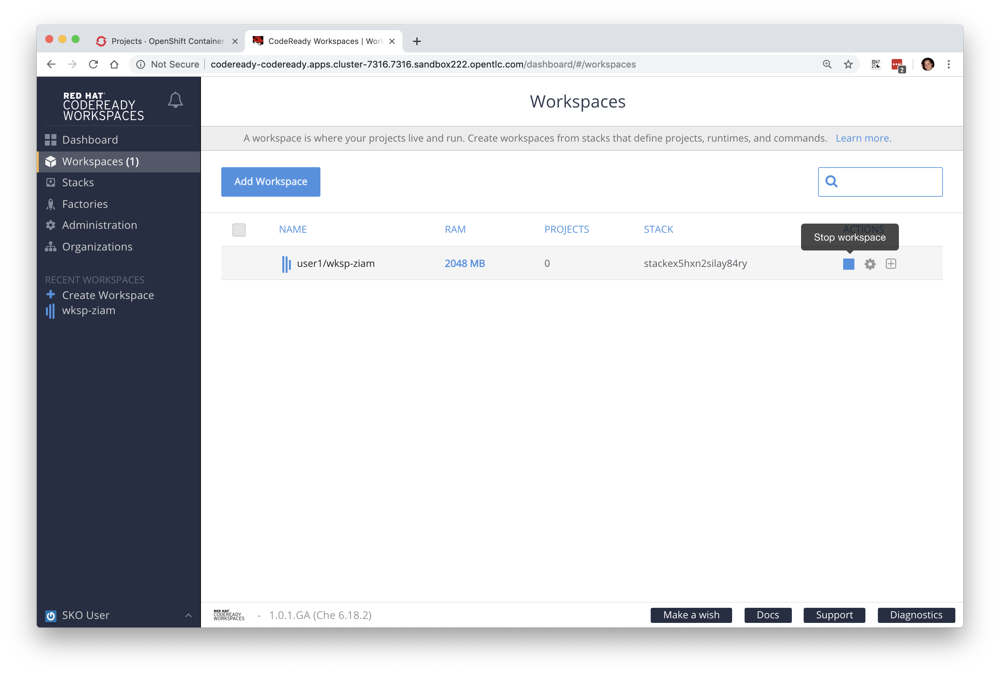

You may get an error popup which you can ignore (regarding failed runtime start). Then, click the "Start" button (Triangle/Play shape) to restart the workspace, which should workaround the bug. Then click the name of the workspace on the left menu (under **RECENT WORKSPACES**) to watch the workspace start up.

After a while you should see a successful startup and empty project:

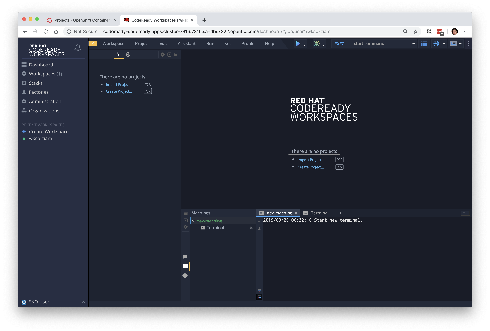

Next, Click _Import Project..._ to import the example application we'll be working with. Choose **GitHub** as the source of the import, and use the following sample project URL:

`https://github.com/infinispan-demos/harry-potter-quarkus`

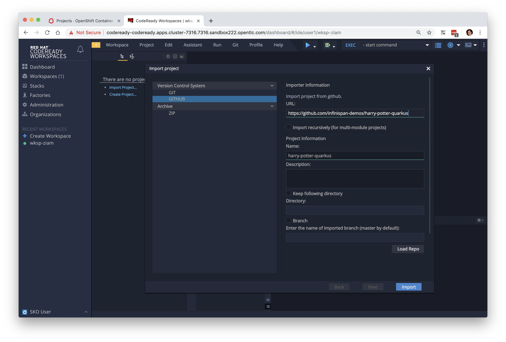

This is a sample application that uses Red Hat Data Grid and [Quarkus.io](https://quarkus.io) to create a blazingly fast reactive, event-driven Java application.

Click _Import_. On the next screen (after import is successful) be sure to choose the _Java_ > _Maven_ project type, and click _Save_. You've now imported the sample app, and should be able to see the codebase on the left project navigator (feel free to expand the tree of project classes/files):

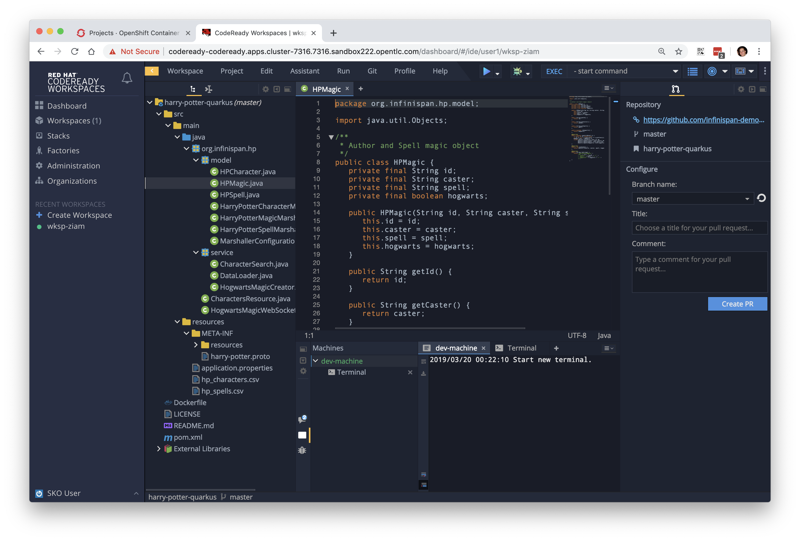

Configure project
=================
Open the sample application's configuration file at `src/main/resources/application.properties`. This file contains default values which need to be changed to work in our environment. 

Replace the contents of this file with the following code:

```
quarkus.http.port=8080
quarkus.http.host=0.0.0.0
quarkus.infinispan-client.server-list=datagrid-hotrod.skodemo:11222

characters.filename = hp_characters.csv
spells.filename = hp_spells.csv
```
This will cause our application to listen on TCP port `8080`, across all interfaces, and use the Data Grid service we previously installed:

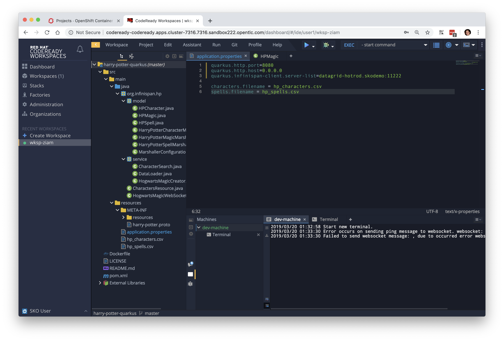

Test locally
============
Typically you will want to test your code first, before deploying to OpenShift. On the top menu bar (where it has Workspace, Project Edit, etc) you'll see a big blue "Play" button; select that and choose **Build and Run Locally**. It will take a minute or two to download dependencies, then it should be ready when you start seeing log file messages in the bottom right corner of the window like:

```
2019-03-19 11:32:07,092 INFO  [org.inf.hp.ser.HogwartsMagicCreator] (DefaultQuartzScheduler_Worker-2) ... magic is happening ...
2019-03-19 11:32:07,097 INFO  [org.inf.hp.ser.HogwartsMagicCreator] (DefaultQuartzScheduler_Worker-2) Vernon Dursley can't perform magic
...
```

This will run the `mvn quarkus:dev` command and show its output on the console, which will run the sample application in development mode, with "Live Reload" enabled.

You'll also notice a Preview URL at the top of the console:

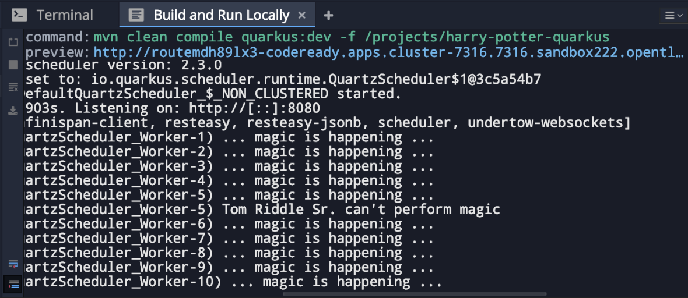

This provides a link to a dynamically-created OpenShift route that is created for our containerised development environment in which our sample app is running. Click on the Preview URL to open the link in your Browser. You should see the sample UI in your browser, along with a running list of spells cast:

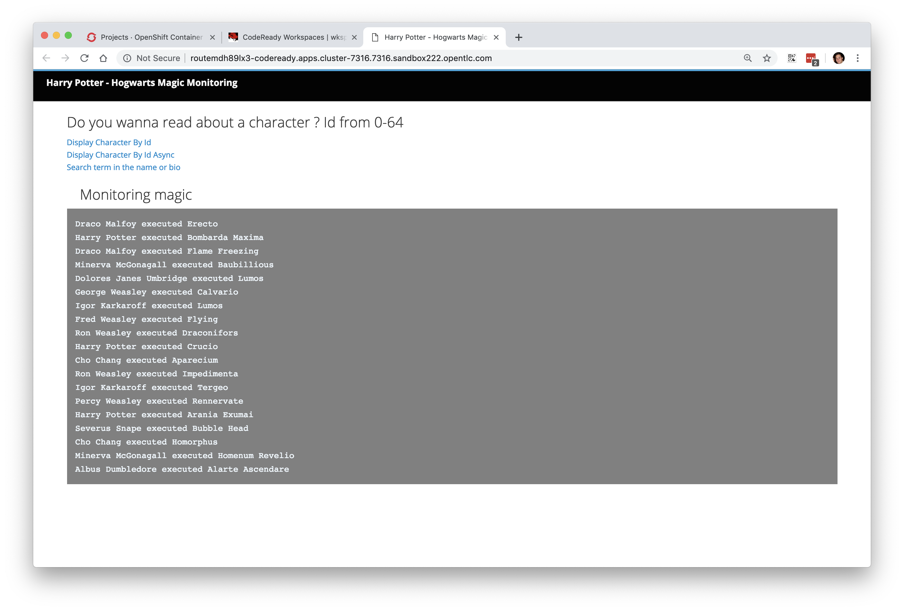

Keep this browser window visible for the next section!

Try out Live Reload
===================
One of the features of the Quarkus project is the ability to Live Reload very quickly, even for Java projects. Return to the tab where your CodeReady Workspace is running and open the file `src/main/java/org/infinispan/hp/HogwartsMagicWebSocket.java` and look at line 58, and change the log file message from "execute" to "cast":

```java
session.getBasicRemote().sendText(value.getCaster() + " CAST " + value.getSpell());
```

CodeReady Workspaces automatically saves "dirty" files every second and as we're just "building and testing locally" our changes should be immediately represented. So return to the application preview tab where it's outputting the spells and reload the page - you'll immediately notice that the value changes in your browser:

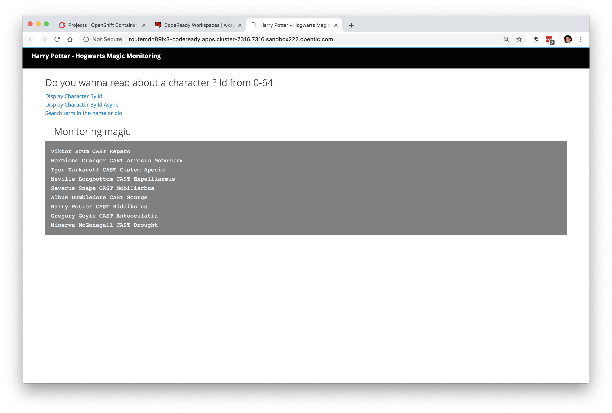

Pretty cool, eh? You can repeat the above process as much as you want. When you're finished, close the preview browser window and then go back to the CodeReady console for your running project (where the title is "Build and Run Locally", and close it with the 'X' button in the tab title. This also terminates the locally running app - it will ask you to confirm.

Now that we've confirmed our app works well "locally", let's deploy it using the `odo` CLI. OpenShift Do (`odo`) is a CLI tool for developers who are writing, building, and deploying applications on OpenShift. With odo, developers get an opinionated CLI tool that supports fast, iterative development which abstracts away Kubernetes and OpenShift concepts, thus allowing them to focus on what's most important to them: code.

Deploy using `odo`
==================

CodeReady Workspaces provides pre-created _stacks_ which give developers the languages, frameworks, and tools they need to be highly productive in a containerised environment. We'll be using a couple of command line tools. You're probably familiar with `oc`, and we'll also use `odo` (OpenShift DO!) to work with our development projects. 

To login with `oc`, Click on Terminal at the bottom of the CodeReady screen to open the Terminal, you can also re-size the terminal window to make it easier to use:

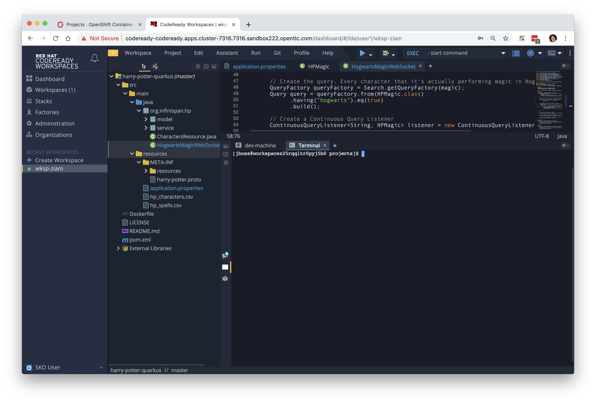

> **NOTE**: If for some reason the Terminal becomes unresponsive, just close it with the "X" button in the Terminal tab, and open a new one using the `+` button to the right of the Terminal tabs.

Within this terminal, we'll login with the same credentials you were given at the start of this lab. Login with the following command in the Terminal:

~~~bash
$ oc login --server <your OpenShift API endpoint>
~~~

Use the standard username and password combination for the admin user that you were provided with previously.

> **NOTE**: You can find your API endpoint by referring to your email from RHPDS.

Next, switch to our development project within OpenShift:

~~~bash
$ oc project skodemo
Now using project "skodemo" on server "https://api.cluster-7316.7316.sandbox222.opentlc.com:6443".
~~~

At this point, we're ready to deploy. Let's use the typical developer workflow to login and deploy the project with `odo`. First, we'll create the app in the context of odo. Run the following in your Terminal:

~~~bash
$ cd /projects/harry-potter-quarkus
$ odo app create potter-app
Creating application: potter-app in project: skodemo
Switched to application: potter-app in project: skodemo
~~~

Next, create a Java component within the app called `magic`:


~~~bash
$ odo create java magic
 ✓  Checking component
 ✓  Checking component version
 ✓  Initializing 'magic' component
 ✓  Creating component magic
 ✓  Component 'magic' was created and ports 8080/TCP,8443/TCP,8778/TCP were opened
 ✓  Component 'magic' is now set as active component
To push source code to the component run 'odo push'
This may take few moments to be ready
~~~

You should have a terminal that closely resembles this:

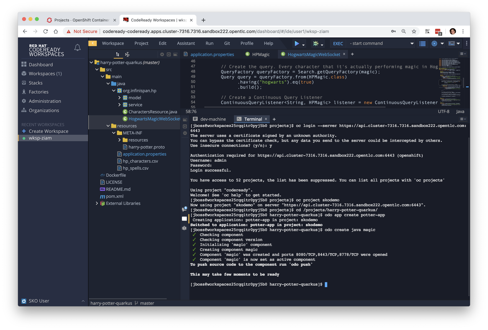

odo lets you manage separate projects, switching between them with `odo project set`. For more information on odo, run `odo help` or check out its [home on GitHub](https://github.com/redhat-developer/odo).

Quarkus projects have create two different JAR files, but we only want one of them to appear in our final project at runtime, so issue the following command to override which build artifacts are used:

~~~bash
$ oc set env dc/magic-potter-app ARTIFACT_COPY_ARGS='-r *runner.jar lib *.csv'
deploymentconfig.apps.openshift.io/magic-potter-app updated
~~~

Finally, push the code to the container:

~~~bash
$ odo push
Pushing changes to component: magic
 ✓  Waiting for component to start
 ✓  Copying files to component
 ✓  Building component
 ✓  Changes successfully pushed to component: magic
~~~

This will take a few minutes to build and start the app on OpenShift. During the build, odo will cache the Maven artifacts so future builds and deploys are lightning fast. When that's done, create a URL to it (actually creates an OpenShift Route):

~~~bash
$ odo url create --port=8080
 ✓  URL created for component: magic

magic-8080 - http://magic-8080-potter-app-skodemo.apps.cluster-7316.7316.sandbox222.opentlc.com
~~~

This last command will output the URL to our newly created application. Open that URL in your browser (it may take a few minutes to spawn the application properly, so you may get some `Application is not available` errors... once it's ready you should get the same UI from before, only this time running within OpenShift as a true containerised application, developed using CodeReady Workspaces, deployed with `odo`, and using Red Hat Middleware application services to execute its business logic, all within the OpenShift 4 Container Platform. Congratulations!

## Try Out More Operators

Operators are a powerful way for cluster administrators to extend the cluster,
so that developers can build their apps and services in a self-service way. With
the expertise baked into an Operator, running high quality, production
instructure has never been easier.

OperatorHub will be continually updated with more great Operators from Red Hat,
certified partners and the Kubernetes community.

# Configuring Authentication
OpenShift 4 installs with two effective superusers out of the box:

* `kubeadmin` (technically an alias for `kube:admin`)
* `system:admin`

Why two? Because `system:admin` is a user that uses a certificate to login
and has no password. Therefore this superuser cannot log-in to the web
console (which requires a password). As part of the lab setup, we set the 'admin' password as part of the initial setup, before you started working on these materials.

If you want additional users to be able to authenticate to and use the
cluster, you must configure an authentication provider. In this example we will configure a basic `htpasswd` implementation that relies on a specific authentication file that's hashed for security. Production environments would rely on something much more comprehensive and scalable.

## Create the htpasswd file
Let's first create the `htpasswd` file manually; there's a number of ways that this can be done but an easy way is to use `openssl` to do this for us:

~~~bash
$ printf "sko2019:$(openssl passwd -apr1 openshift4)\n" >> ~/htpasswd"
~~~

This will create a user called "**sko2019**" with password "**openshift4**".

If you **don't** want to create a file, you can use the following sample file:

~~~bash
$ wget https://raw.githubusercontent.com/openshift/training/master/assets/htpasswd
~~~

> **NOTE**: If you executed the above wget, it will likely have wiped out your manually generated file. Exercise caution here.

The sample file has four different users - `susan`, `john`, `ramses`, and `elise`; regardless of whether you created the htpasswd file manually, or used the sample file, the password is `openshift4` for all users.

Regardless of whether you've created a new htpasswd file, or you've downloaded the sample, we need to re-add the `admin` user to the htpasswd file. This is because we're already using htpasswd authentication as part of the SKO bootstrap environment:

~~~bash
$ printf "admin:$(openssl passwd -apr1 r3dh4t1\!)\n" >> htpasswd
~~~

> **NOTE**: Failure to run the above command will lock your admin user out of the cluster, and you won't be able to return back to the environment after the lab has ended.

## Create the htpasswd secret
The authentication operator will read the `htpasswd` file from a secret in
the `openshift-config` project. Go ahead and create that secret using the
following command:

~~~bash
$ oc create secret generic htpass-secret --from-file=htpasswd=htpasswd -n openshift-config
secret/htpass-secret created
~~~

> **NOTE**: The above command assumes that `htpasswd` is the filename that you're wanting to use, and is in your current working directory. If it's not, you will need to specify the full location.

## Create the Identity Provider Custom Resource
The operator that configures authentication is looking for a `CustomResource`
object. In our case, we want one that tells it to configure htpasswd
authentication using the provided secret. Here's what that definition looks
like:

```YAML
apiVersion: config.openshift.io/v1
kind: OAuth
metadata:
  name: cluster
spec:
  identityProviders:
  - name: my_htpasswd_provider 
    challenge: true 
    login: true 
    mappingMethod: claim 
    type: HTPasswd
    htpasswd:
      fileData:
        name: htpass-secret 
```

Note the name of the secret in the above definition matches the name of the secret that we just created with our `htpasswd` file. If you are interested, the CRD that defines `OAuth` is `oauths.config.openshift.io`. It is a cluster-scoped object. Go ahead and
create the CR for auth with the following command:

~~~bash
$ oc apply -f https://raw.githubusercontent.com/openshift/training/master/assets/htpasswd-cr.yaml
~~~

You might be wondering why `apply` was used here. It is because there is an
existing `OAuth` called `cluster`. The `apply` command will overwrite/patch
existing objects.

## Test Authentication
When you created the CR, the authentication operator reconfigured the cluster
to use htpasswd authentication. After a few moments, you should be able to
`oc login` as one of the users you created. If you used our example file, we
have a user called `susan`:

~~~bash
oc login -u susan -p openshift4
~~~

You should see something like the following:

```
Login successful.

You don't have any projects. You can try to create a new project, by running

    oc new-project <projectname>
```

## Return to the Admin User

Before proceeding with the rest of the instructions, log back in as the administrator using the administrator credentials you were provided with when you installed OpenShift.

~~~bash
$ oc login
Authentication required for https://... (openshift)
Username: <your username>
Password: <your password>

Login successful.
(...)
~~~


